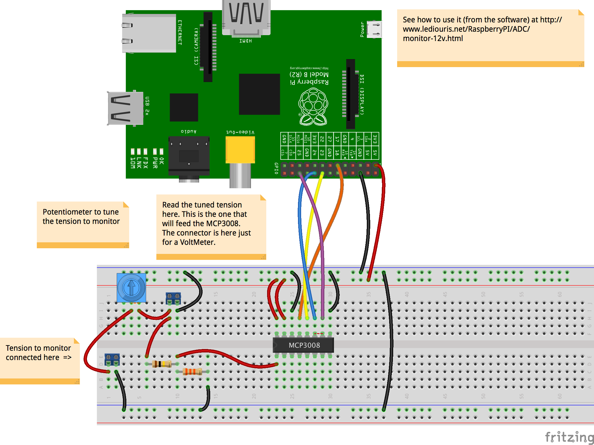
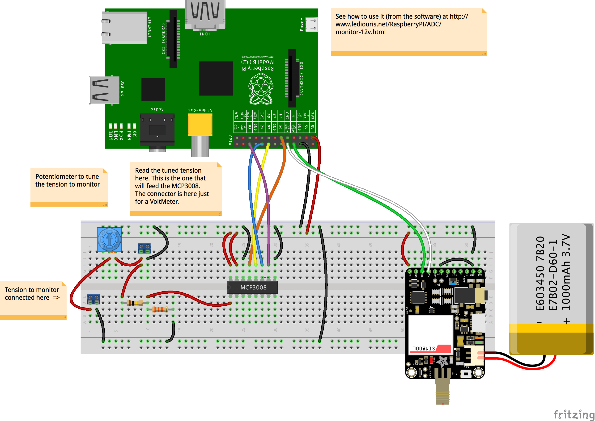
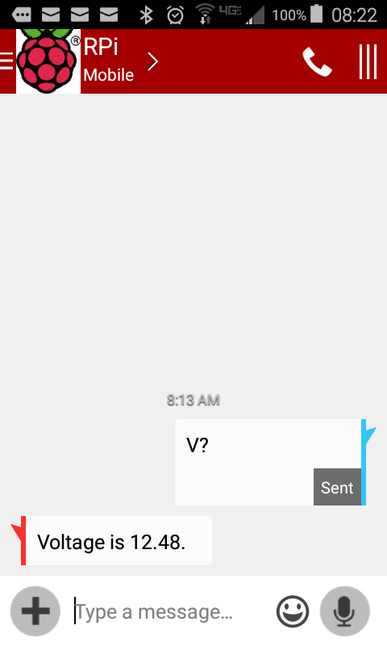
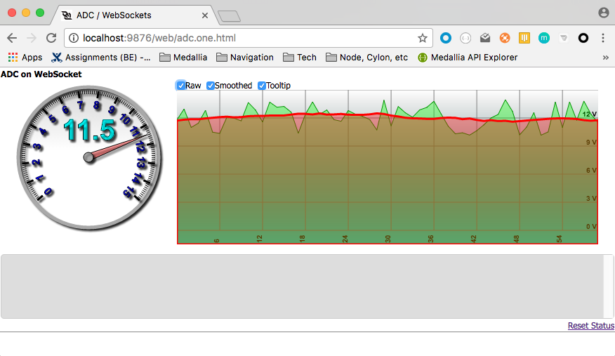
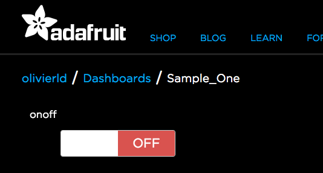

# How to remotely monitor...

## ...A Battery
 Options and possibilities to transmit data

 This is a _functioning_ example intending to demonstrate how to publish information gathered from the Raspberry PI.
 The information here is the tension (aka voltage) of a battery.
 The battery can be in a remote place, and from wherever you are, you want to make sure its level does not
 drop below a given threshold.

 All the code - mentioned below and contained in this project - can be run for real.

##### Read the tension
 As the Raspberry PI's GPIO pins are all digital ones, to read the battery's tension, you need an Analog to Digital Converter (ADC).
 As you can see in the Fritzing diagram below, we will use here an MCP3008. It is cheap, and good enough for our purpose.

##### Publish it
 This is where we have several options, which we discuss below.

### The battery monitoring trinket
How to build and connect:



#### NMEA?
NMEA stands for National Marine Electronics Association. It is one of the oldest IT standards.

Battery Voltage can be described by a sentence like
```
 $AAXDR,U,12.34,V,TRINKET*3C
```
Many NMEA parsers are available. NMEA could be an option to consider, in case the
management of the output of the trinket above was to be automated.

## Before you run anything
After cloning the git repo, to run everything this document is about, all you need is to compile and archive the code:
```bash
 ../gradlew clean shadowJar
```
This requires Java 8.
If no error or wacky message shows up, you're good.

### By email
If there is Internet access in the location where the trinket is, and
if you have an email account, then sending the battery voltage by email could be an option, keeping in mind
that it is not a _real time_ communication, there is always a delay between the moment when an email
is sent and the moment when it is received.

It can go both ways though. The Raspberry PI can send emails, and receive some (by polling the INBOX).
As long as the _received_ email complies with a given format, it can be parsed and then managed accordingly.

#### Example
 You need clone the file named `email.properties.sample` into `email.properties`, and modify it with the details of the email account(s)
 you want to use.

All you need to add to the diagram above is a network connection.

 Then use for example
```bash
 ./email.battery -verbose -send:google -sendto:me@home.net,you@yourplace.biz -loop:6h
```
You will receive an email, in this case every 6 hours, containing the expected battery tension.


##### Pros
- Free
- Easy

##### Cons
- Requires Internet Network connection
- Not real-time, delayed.

### By SMS
If you do not have Internet coverage in your location, you could use a device like a `FONA` to reach out to a cell-phone network.
The FONA requires a SIM Card.



##### Pros
- Can be available where Internet is not

##### Cons
- Not Free (you need a SIM Card)
- Not real-time, delayed.

###### At work
From a terminal, start `./battery.fona`
```bash
$ ./battery.fona
Creating BatteryMonitor...
Serial Communication.
 ... connect using port /dev/ttyUSB1:9600
 ... data received on serial port should be displayed below.
Opening port [/dev/ttyUSB1:9600]
Value range: ADC=0 => V=0.0, ADC=1023 => V=15.0
Port is opened.
Establishing connection (can take up to 3 seconds).
From ADC Observer: volume 89, value 915, voltage 13.416422
FONA Connected!
Connection established.
From ADC Observer: volume 86, value 883, voltage 12.947214
From ADC Observer: volume 84, value 867, voltage 12.712610
...
From ADC Observer: volume 81, value 838, voltage 12.287390
From ADC Observer: volume 83, value 857, voltage 12.565983
From ADC Observer: volume 86, value 884, voltage 12.961877
Received mess #8
From ADC Observer: volume 83, value 851, voltage 12.478005
From +14157455209, 2 char : V?
From ADC Observer: volume 89, value 913, voltage 13.387096
...
From ADC Observer: volume 86, value 883, voltage 12.947214
From ADC Observer: volume 82, value 840, voltage 12.316715
		>>>> Deleting mess #8
From ADC Observer: volume 86, value 887, voltage 13.005865
Message #8 deleted:OK
From ADC Observer: volume 83, value 855, voltage 12.536657
From ADC Observer: volume 87, value 891, voltage 13.064516
^C
Program stopped by user's request.
Bye!
$
```

From your phone, send a message like `V?` (not case sensitive) to the FONA.
It will reply with the expected tension, as shown below.

Notice in the console above when the request is received, and when the response is sent (before deleting the incoming message).

<!--  -->


<!--
### Outernet ?
[Outernet](https://outernet.is/) might also be something to consider, if you are _really_ out of reach of any kind of network (at sea, far in the desert, etc).

More soon about that one...

##### Pros
- Available everywhere on Earth.

##### Cons
- Requires extra hardware
- Not real-time, delayed.
- Slow
-->

### WebSocket
WebSocket is a very cool technology, based on TCP. Obviously available on the server side of the world, but also
implemented with HTML5, and available from browsers supporting it, in JavaScript.
Can be seen as a publish/subscribe mechanism.

In a protocol like HTTP for example, you need to submit a request to get a response.
**For example**: you want to know at what time a given plane is going to land.
You go to the airline's web site, you navigate to the 'Flight status' page, and
you probably find your information. In case the flight status changes, you need to _refresh_ your page
to see it. With a publish/subscribe protocol (like WebSocket), you would subscribe to an
event like `flight-status-update`, and whenever such an update happens on the server side, the
corresponding message would be sent to your browser, without you having to request it.

In our case, we would have:
- The Raspberry PI publishing events to a WebSocket server
- All the clients having subscribed to those events would be notified

It obviously requires a WebSocket Server.
 NodeJS can be one.

 Could be very convenient for a Local Area Network (LAN), like between devices within the same home for example.

###### To run it on your LAN
You need to have installed NodeJS on the Raspberry PI (Google it if needed, you'll find how).

 First time installation (local WebSocket server):
```bash
 npm install
 ```

Then, start the server:
```bash
 npm start
```
or
```bash
 node wsbattery.js
```

After that you start the script named `ws.publish.battery`
```bash
 ./ws.publish.battery
```
and from a browser, go to `http://localhost:9876/web/adc.one.html`. NodeJS is hosting both the WebSocket server and an http server.
If you access the page remotely, replace `localhost` with the address of the Raspberry PI.

<!--  -->


Every second, the WebSocket server pushes a message to the connected client(s). The display above is updated accordingly.

##### Pros
- Easy
- Real time
- Supported on clients and servers.
- Great for clients, notified without having to request a message to get it.

##### Cons
- Requires a WebSocket server

### IoT (Internet Of Things)

#### Using MQTT
Now we 've talked about the WebSocket approach above, the Internet Of Things (IoT) one
flows naturally. MQTT (Message Queuing Telemetry Transport) implements a pure publish/subscribe dialog, very easy to deal with (even easier than WebSocket).

There is [here](http://www.hivemq.com/) a lot of good readings about MQTT.

It also requires a server - which we will call an IoT server - where events will be published,
from the Raspberry PI in our case. Then whatever client understanding the protocol(s) available on
the server can read those events, and get the corresponding data.
More and more IoT servers support the MQTT protocol.
`Mosquitto` runs fine on the Raspberry PI, look [here](http://hackaday.com/2016/05/09/minimal-mqtt-building-a-broker/) to see how to install it.

Several IoT servers are free to access, like [Adafruit.IO](https://io.adafruit.com/). You
just need to create your free account, and remember your Token.
`AdafruitIO` supports MQTT and also provides a neat REST interface.

To access MQTT from Java, I use [paho](http://www.eclipse.org/paho/), as you can see in the `dependencies`
section of the `build.gradle` file of this project.

An MQTT server like `Mosquitto` is also perfectly suited for a LAN configuration.

##### Pros
- Can be free
- Flexible
- Pub/Sub

##### Cons
- Requires Internet Network connection
- MQTT is not directly supported in a browser
- Needs a reliable connection.

#### Using REST
REST stands for Representational State Transfer. Has recently gained a lot of popularity.
Built on top of the HTTP Protocol, and as such also available from a browser.
But for the same reason, it is a Request/Response based protocol.

It makes no difference when you publish en event, but it would make one for a client expecting it.
In the case of WebSocket or MQTT, the client would be notified by the server. In the case of REST, the client would need
to _request_ a _response_ to get it. Polling the server is still possible, but certainly
not as elegant.

##### Pros
- Can be free
- Many libraries available.
- Connection needs to be establish only when used.

##### Cons
- Requires Internet Network connection
- Request/Response protocol

##### Note
Again, MQTT requires a persistent connection.
REST is connected _only_ when an exchange happens.

#### Example with Adafruit.IO
You need an Adafruit-IO account (free).
Using mine, I've created a feed named `onoff`, looking as follow on the [Adafruit-IO web site](http://io.adafruit.com):

<!-- -->


You will need two things to go further:
- Your Adafruit.IO `username`
- Your Adafruit.IO `key`

##### Using MQTT
Then you can run the Publisher part, providing your `username` and `key`:
```bash
 ./aio.publish olivierld 54xxx7678yyy93f2ezzzc45d62aaaae9f8056
```
Everytime you hit `[Return]`, you should see the switch toggling in the web page. Hit `Q` to terminate the program.
```bash
 ./aio.publish olivierld 54xxx7678yyy93f2ezzzc45d62aaaae9f8056
 Usage:
 ./aio.publish [AIO Username] [AIO Key]
 like ./aio.publish olivierld abc8736hgfd78638620ngs
 Connected to tcp://io.adafruit.com:1883 as olivierld-pub.
 Hit return to toggle the switch, Q to exit.
 Hit [Return]
 Published data. Topic: olivierld/feeds/onoff  Message: ON
 Hit [Return]
 Published data. Topic: olivierld/feeds/onoff  Message: OFF
 Hit [Return]
 Published data. Topic: olivierld/feeds/onoff  Message: ON
 Hit [Return] q

 Client disconnected.
 Bye.
```

You can also write your own Subscriber, reacting to any modification of the feed, just
like the Web UI did:
```bash
 ./aio.subscribe olivierld 54xxx7678yyy93f2ezzzc45d62aaaae9f8056
 Subscriber is now listening to olivierld/feeds/onoff
 Message arrived. Topic: olivierld/feeds/onoff Message: ON
 Message arrived. Topic: olivierld/feeds/onoff Message: OFF
 Message arrived. Topic: olivierld/feeds/onoff Message: ON

 [Ctrl+C]
 Client disconnected.
 Bye.
```

##### Using REST
You can set the switch value using REST:
```bash
 ./aio.post 54xxx7678yyy93f2ezzzc45d62aaaae9f8056
 Usage:
 ./aio.post [AIO Key]
 like ./aio.post abc8736hgfd78638620ngs
 Hit return to toggle the switch, Q to exit.
 Hit [Return]
 Sending {"value": "ON"}
 POST Ret:201
 Hit [Return]
 Sending {"value": "OFF"}
 POST Ret:201
 Hit [Return] q
 Bye.

```
The switch toggles just like with MQTT.

Interestingly, the MQTT subscriber mentioned above (`aio.subscribe`) also works when the switch has been fed with REST.

#### IoT for Real
Just like we said before, a feed named `battery-pi` has been created on Adafruit.IO:


For all the samples below, you do not need a FONA. Just a connection to the Internet (Wireless or Ethernet).

###### MQTT
```bash
 ./aio.battery.publish olivierld 54x2x6yy78cazz3f2e3aa45bb2accaedd8056
```

You would see the widget above reacting as the tension is read from the Raspberry PI.
###### REST
```bash
 ./aio.battery.post 54x2x6yy78cazz3f2e3aa45bb2accaedd8056
```
The widget reacts every time you hit return.

#### Bridging the gap between MQTT and WebSocket
- MQTT is supported by most of - if not all - the IoT servers you can reach,
 but it is _not_ directly supported by the browsers.
- WebSocket is supported by the modern browsers, but most of the IoT servers you can reach do not provide this protocol.

So, to access tha data provided by an MQTT server from a browser, we need some process that would broadcast the MQTT data over WebSocket.
[NodeRED](http://nodered.org) provides such possibility, easily.


One input node reads the Adafruit-IO MQTT topic, and forwards it to a local WebSocket server (running on node too),
started with `node wsbattery.js`, and that is it. The page [http://localhost:9876/web/adc.one.html](http://localhost:9876/web/adc.one.html) is available:


[Here](./nodered.flow.json) is the flow you need to import in Node-RED.

You need to modify the MQTT Node to enter your own credentials.
- Server: `io.adafruit.com:1883`
  - In the Connection tab, leave the `Client ID` blank
  - In the Security tab, enter your Adafruit-IO username and password.
- Topic: `olivierld/feeds/battery-pi` Make sure your user-name preceeds the feed name.


### Next?
There is a lot more to do with the options and features described above, specially in the User Interface area.
Your imagination is the limit...
