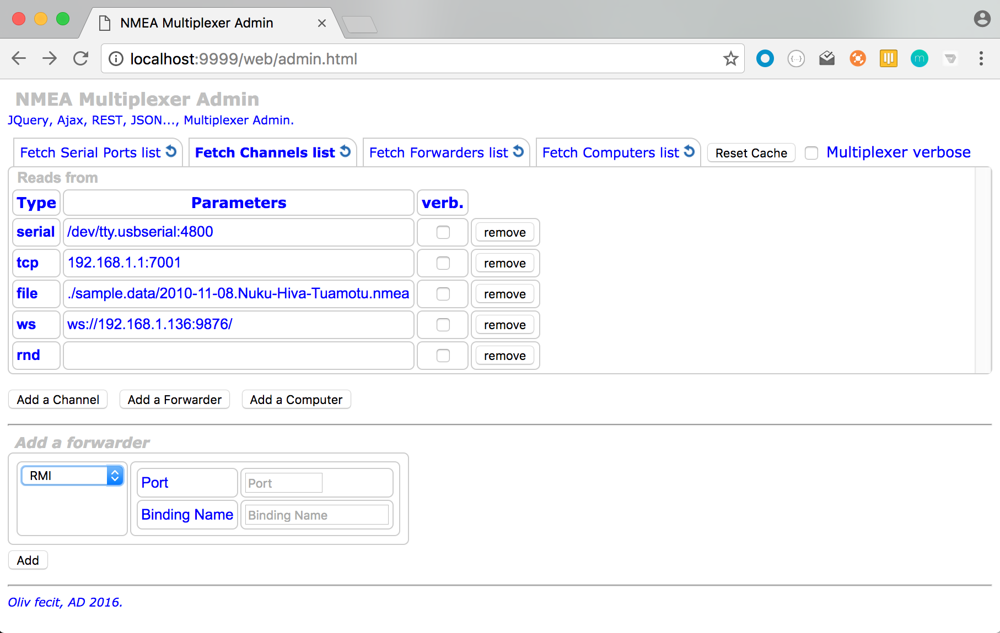
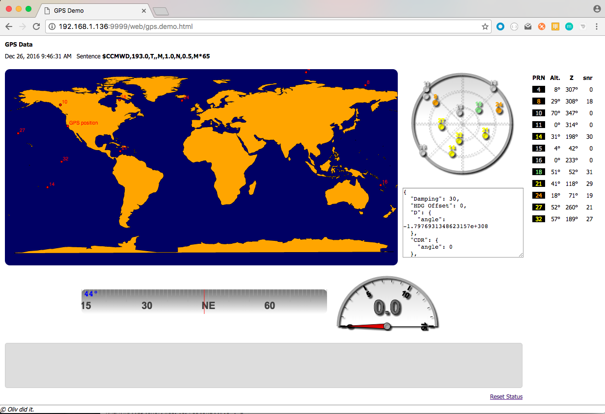

# NMEA Multiplexer
Any input (File, Serial, TCP, UDP, WebSocket, Sensors, Computations, ...), any output (File, Serial, TCP, UDP, WebSockets...), and a REST API on top of that.

Designed to run on very small boards, like a Raspberry PI Zero, and with no Internet access.

### Includes
- NMEA Strings Parser
- NMEA Strings generator
- Serial port Reader / Writer
- TCP Reader / Writer
- UDP Reader / Writer
- WebSocket client (read/write)

### Some definitions
At the center of the picture, there is the Multiplexer (aka MUX).

The MUX _reads_ from `channels` and _writes_ to `forwarders`.

A _channel_ is an NMEA data provider, a _forwarder_ is an NMEA data producer.

In addition, we can have _sensors_. A _sensor_ is reading data from a transducer, and produces NMEA sentences read by the Mux. In other words, a _sensor_ is talking to the Multiplexer,
and can be seen as a _channel_.

Also, a _computer_ is using NMEA data collected by the Multiplexer to produce other NMEA data that will be broadcasted by the _forwarders_.
For example, True Wind computed with Apparent Wind data and the GPS data.

_Note_: to compute the required data, we have a **cache**, where the data required _by_ the computers are pushed.
This cache is initialized before starting the computers, with parameters contained in the
properties file used at startup.

This cache is necessary to perform damping and smoothing operations - among others.

Finally, we have _tranformers_, that transform NMEA data into another (proprietary) format, and then behave like a a regular _forwarder_ to provide them to whoever is interested.
 A _transformer_ is also a _forwarder_. See below examples of `transformers`.

##### Examples
Channels:
- **Serial** reads NMEA data from a Serial Port
- **TCP** reads NMEA data from a TCP server
- **WebSocket** reads NMEA data from a WebSocket server (this is a WebSocket client)
- **File** reads NMEA data from a log file
- etc

Forwarders:
- **Serial** writes NMEA data to a Serial Port (not implemented yet)
- **TCP** writes NMEA data to a TCP port
- **WebSocket** writes NMEA data to a WebSocket server (this is _also_ a WebSocket client)
- **File** write NMEA data to a log file
- etc

Sensors:
- **BME280** reads raw data from a BME280 sensor (Temperature, Pressure, Humidity), and produces `XDR` and `MDA` NMEA Sentences.
- **LSM303** reads raw data from a LSM303 sensor (3D magnetometer), and produces `XDR` NMEA Sentences.


Computers:
- **True Wind** computer (produces `MDA`, `MWD` data)
- **Current** computer (produces `VDR` data)

Transformers (incubating):
- **GPSD** data
- **Custom** data

##### A word about the Current Computer
A basic approach to compute the current would be to do it by instant triangulation, figuring the Course Made Good (CMG)
and comparing it with the GPS Data (Course and Speed Over Ground).
A better approach turned out to compute the current over a given period of time.
For example, you can perform this calculation by comparing the position you should be at with the CMG only (i.e. as if there was no current)
 and the one given by the GPS, over periods like 30 seconds, 1 minute, 10 minutes, etc, using a smoothing of the Boat Speed (BSP) and the CMG.
 The cache is designed to manage several such computations in parallel, they are discriminated by the lenght of their time-buffer (30 seconds, 5 minutes, etc).
The accuracy of such a computations is _much higher_ than the instant triangulation.
See [this article](http://www.lediouris.net/RaspberryPI/_Articles/readme.html) for details.

#### Overview


_Note: There is no Transformer on the picture above_

#### Note
There is an **rmi** forwarder. This is a work in progress, but it works.
It is feeding an RMI server that can then be accessed by an RMI client.
See an example of such a client in `samples.rmi.client.SampleRMIClient`.

### To see it at work
See the class `nmea.mux.GenericNMEAMultiplexer`, it uses the file `nmea.mux.properties` to define what to read, and what to re-broacdast it to. 
See it to understand its content (should be clear enough).

To compile and build:
```
 $> ../gradlew shadowJar
```
To run it, modify `mux.sh` to fit your environment, and run
```
 $> ./mux.sh
```

##### About transformers
There is an example of a `transformer` in `WebSocketProcessor.java`. As you would see, it is just implementing the `Forwarder` interface,
and this is where it fits in the picture above.
A `Transformer` is just reworking the data before forwarding them as a regular `forwarder` would.

The example in `WebSocketProcessor.java` is transforming the NMEA Data in the format expected by a Pebble (this is a smart watch) application.
See it [here](https://github.com/OlivierLD/pebble/tree/master/NMEA.app). Data are expected as a json object, over WebSocket.
The expected data look like:
```json
{
    "gpstime": 1290377346000,
    "gpsdatetime": 1290377346000,
    "wp": "RANGI   ",
    "d2wp": 561.6,
    "b2wp": 230,
    "xte": 3.0,
    "lat": -9.1102,
    "lng": -140.21108333333333,
    "gpssolardate": 1290343695340,
    "log": 3013.0,
    "daylog": 12.4,
    "cog": 218,
    "sog": 7.2,
    "awa": -121,
    "aws": 17.8,
    "dbt": 1.7000000476837158,
    "hdg": 220,
    "bsp": 6.6,
    "wtemp": 26.5,
    "atemp": 0.0,
    "D": 10.0,
    "d": -0.9830777902388692,
    "W": 9.01692220976113,
    "leeway": 0.0,
    "cmg": 229,
    "tws": 21.4,
    "twa": -139,
    "twd": 89,
    "cdr": 149,
    "csp": 0.29,
    "prmsl": 0.0,
    "hum": 0.0
}
```
The `transformer` reads the data from the cache and generates such an object. Then it is sent to a WebSocket server.
###### To run this transformer example
Start the websocket server, on a port of your choice:
```bash
 $> node wsnmea.js -port:1234
```
Define your transformer in the `properties` file:
```properties
forward.07.type=wsp
forward.07.wsuri=ws://localhost:1234/
```
Make sure you have configured the Pebble application [as required](https://github.com/OlivierLD/pebble/tree/master/NMEA.app) (WebSocket URI), and you are good to go.

<table>
  <tr>
    <td>
      Application list
      <br/>
      
    </td>
    <td>
      Press select to start
      <br/>
      
    </td>
    <td>
      Srcoll...
      <br/>
      
    </td>
  </tr>
  <tr>
    <td>
      Choose...
      <br/>
      
    </td>
    <td>
      Displayed!
      <br/>
      
    </td>
  </tr>
</table>


#### WebSockets
WebSocket protocol is supported, in input, and in output.
If needed, you can start your own local WebSocket server, running on `nodejs`.
To install it (once):
```bash
 $> npm install
```
Then, to run it,
```bash
 $> node wsnmea.js
```
or
```bash
 $> npm start
```

## REST Admin Interface
The properties files like `nmea.mux.proeprties` defines the configuration at startup.

You can remotely manage the input channels and the re-broadcasting ones through a REST interface.
The soft includes a dedicated HTTP Server. The http port is driven by a property (in `nmea.mux.properties`).
Same if you want the HTTP server to be started or not.
```properties
with.http.server=yes
http.port=9999

```
This HTTP Server is designed and written to run on small computers (like the Raspberry PI Zero).
It is **_NOT_** an enterprise server, and it will **_NOT_** scale as one.

### Supported end-points (for now)

#### List of operations
A full list of the available REST services is available at 
```
 GET /oplist
```


##### Examples
```
 GET /serial-ports
```
returns a payload as:
```
[
  "/dev/tty.Bluetooth-Incoming-Port",
  "/dev/cu.Bluetooth-Incoming-Port"
]
```
The list of _available_ serial ports.

``` 
 GET /channels
```
returns a payload like
```json
[
  {
    "cls": "nmeaproviders.client.SerialClient",
    "type": "serial",
    "port": "/dev/ttyUSB0",
    "br": 4800
  },
  {
    "cls": "nmeaproviders.client.BME280Client",
    "type": "bme280"
  }
]
```

``` 
 GET /forwarders
```
returns a payload like
```json
[
  {
    "cls": "servers.TCPWriter",
    "port": 7001,
    "type": "tcp"
  },
  {
    "cls": "servers.ConsoleWriter",
    "type": "console"
  }
]
```

```text 
 DELETE /forwarders/:type
```
`type` is one of
- `file`. requires a body like 
 ```json
{ 
    "log": "./data.nmea",
    "type": "file"
}
```
identical to the elements returned by `GET /forwarders`.
- `console`. requires no body.
- `tcp`. requires a body like 
```json
{
     "port": 7002,
     "type": "tcp"
}
```
identical to the elements returned by `GET /forwarders`.
- `ws`. requires a body like 
```json
{
   "wsUri": "ws://localhost:9876/",
   "type": "ws"
}
```
identical to the elements returned by `GET /forwarders`.

``` 
 DELETE /channels/:type
```

``` 
 POST /forwarders
```
with payloads like:
- `file`. requires a body like 
 ```json
{ 
    "log": "./data.nmea",
    "type": "file"
}
```
identical to the elements returned by `GET /forwarders`.
- `console`. requires a body like 
```json
{ 
     "type": "console"
}
```
- `tcp`. requires a body like 
```json
{
     "port": 7002,
     "type": "tcp"
}
```
identical to the elements returned by `GET /forwarders`.
- `ws`. requires a body like 
```json
{
   "wsUri": "ws://localhost:9876/",
   "type": "ws"
}
```
identical to the elements returned by `GET /forwarders`.

``` 
 POST /channels
```

There is a Web UI using the REST resources above.

_Note_: This Web UI is to be considered  as an example of the way to access the resources. Nothing more.

On the HTTP Port, use a url like `http://machine-name:9999/web/admin.html`,
where `machine-name` is the name of the machine where the multiplexer is running, and `9999` is the port defined in the properties.



And any REST client (NodeJS, Postman, your own code, ...) does the job.

## Open Issues
- UDP client

## Demos

Plug a GPS on the Serial Port, start the multiplexer, and launch [http://localhost:9999/web/gps.demo.html](http://localhost:9999/web/gps.demo.html) in a browser.
This is pinging the `/cache` REST service every second.

Satellites are displayed on the chart, and on the right pane.
When available, Speed Over Ground and Course Over Ground are displayed too. 


## TODO
- 3D compass (LSM303) interface, see http://opencpn.org/ocpn/Basic_data-connections_nmea-sentences (XDR), and http://forum.arduino.cc/index.php?topic=91268.0
- Externalize all definitions, for dynamic configuration (ie 'add your own computer, channel, forwarder', etc).

```
Once you get the X, Y and Z accelerations into floats you just need some trig to calculate Pitch and Roll (in radians):

pitch = atan (x / sqrt(y^2 + z^2));  
roll = atan (y / sqrt(z^2 + z^2));
```

```
Currently, OpenCPN recognizes the following transducers:

------------------------------------------------------------------------------------------------------
Measured Value | Transducer Type | Measured Data                   | Unit of measure | Transducer Name
------------------------------------------------------------------------------------------------------
barometric     | "P" pressure    | 0.8..1.1 or 800..1100           | "B" bar         | "Barometer"
air temperature| "C" temperature |   2 decimals                    | "C" celsius     | "TempAir" or "ENV_OUTAIR_T"
pitch          | "A" angle       |-180..0 nose down 0..180 nose up | "D" degrees     | "PTCH"
rolling        | "A" angle       |-180..0 L         0..180 R       | "D" degrees     | "ROLL"
water temp     | "C" temperature |   2 decimals                    | "C" celsius     | "ENV_WATER_T"
-----------------------------------------------------------------------------------------------------
```

---
