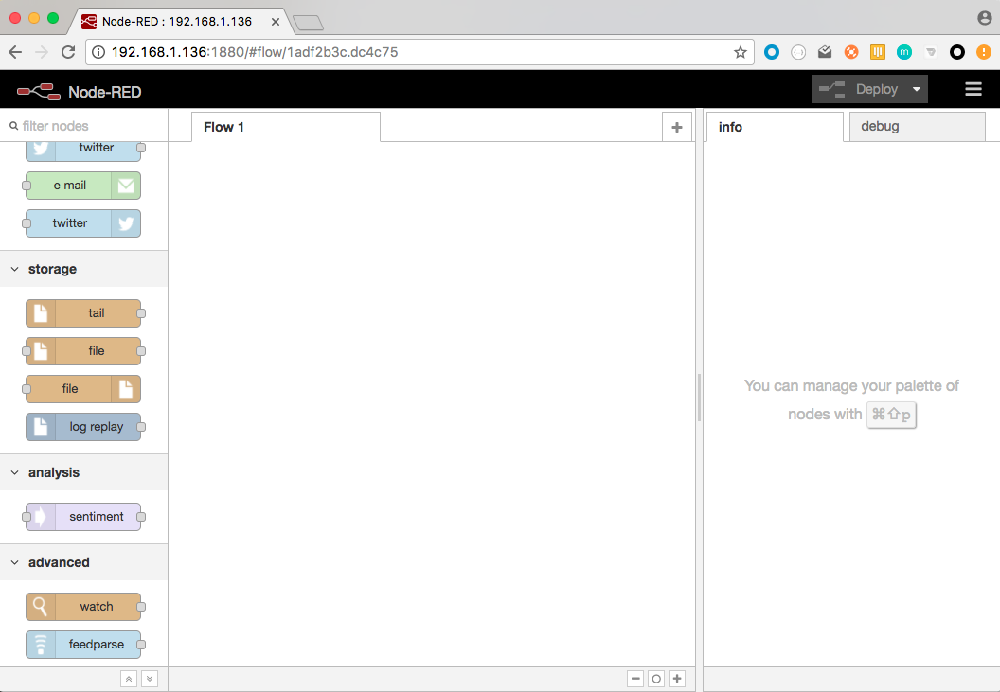
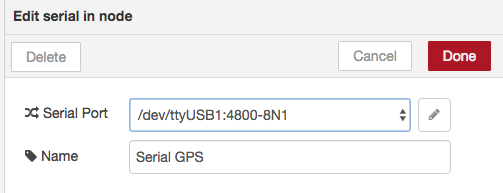
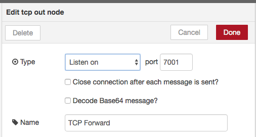
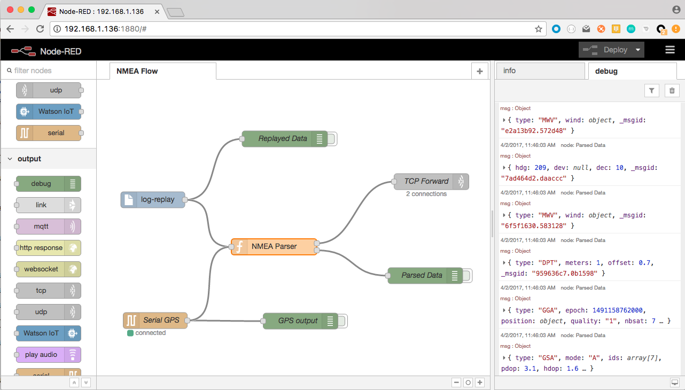

# Raspberry PI Zero W
## Java Custom NMEA Multiplexer, or Node-RED ?

The Raspberry PI Zero W is a small single-board computer that
- Runs Linux (Pixel, a clone of Jessie)
- Has 512 Mb of RAM
- Has a 40-pin GPIO Header
- Has a built-in WiFi (hence the **W**) and Bluetooth Low Energy (BLE) support.
- Costs $10.

As a Linux machine, it runs whatever a Linux machine can run (Python, Java and other JVM-based languages,
NodeJS, Node-RED, etc).

We want to compare here the behavior of an NMEA Multiplexer based on Java (this project), and another
one - a prototype - based on Node-RED, specially the memory footprint.

## Multiplexer on Node-RED.

If not already there, Install [Node-RED](http://nodered.org/) on the Raspberry PI.
Installation instructions for your platform are available [here](http://nodered.org/docs/getting-started/installation.html), and it comes
with Raspberry PI goodies.

_March 2017_: Node-RED is already installed on the NOOBS Image. It also had some cool Nodes already available. A little drawback though: the version of NodeJS is not a recent one.
I upgraded mine (Node v6.10.1, Npm 3.10.10, Node-RED core 0.16.2).

Among others:
- Serial
- RPi GPIO
- Sense HAT
- ...

Node-RED is based on NodeJS, itself based on V8, the Google Chrome's OpenSource JavaScript engine.
As such, NodeJS - and thus Node-RED - is programmable in JavaScript.
For those wondering, Java & Javascript are as related to each other as Ham & Hamburger (said _John Resig_).

To enable the replay of NMEA log file, we've created an extra node, available [here](https://github.com/OlivierLD/node.pi/tree/master/node-red).
> Reading a file in a synchronous way from JavaScript is not as trivial as it would sound.

To make sure we have equivalent features in both cases (Java & Node-RED), we also need an implementation in Node-RED of the features of
the BME280. More details about that soon.

_This document is still a work in progress..._

### Installation of the sample flow
Manually, for now. There is a way to package all that, I'll look into it later.

- Copy or move `NMEAParser.js` in `$HOME/.node-red`
```bash
$> scp NMEAParser.js pi@192.168.1.136:./.node-red
```

- On the Raspberry PI where you have installed `Node-RED`, install `n-readlines`
```bash
 $> cd /usr/lib/node_modules/node-red
 $> sudo npm install n-readlines
```

- Then from the `$HOME/.node-red` directory, edit `settings.js`:
```bash
 $> vi settings.js
```
Make sure `functionGlobalContext` looks like this:
```json
functionGlobalContext: {
        os:require('os'),
        here:__dirname,
        NMEAParser:require('./NMEAParser.js')
    }
```
- Then, move or copy `log-replay.html` and `log-replay.js` in the `/usr/lib/node_modules/node-red/nodes` directory.
- Start `Node-RED`
```bash
 $> node-red-start
```

- Then you can access `Node-RED` from a browser, like with [http://192.168.1.136:1880/](http://192.168.1.136:1880/). You should see
  a node named `log-replay` in the left pane, under the `storage` section.
  
- Then `import` the flow named `NMEA-Parser-flow.js`: Copy its content in the clipboard,
  
  Paste it in the box, click the `Import` button.
  
  See the flow, click `Deploy` at the top-right
  
  Your flow is running.
  

The function `NMEA Parser` is done this way:
```javascript
/*
 * Invoke the NMEA Parser mentioned in the Global settings.
 */
var parser = context.global.NMEAParser;
var processed;
if (parser !== undefined) {
    var nmeaSentence = msg.payload;
    var verbose = msg.verbose;

    if (verbose === true) {
        console.log("Raw data:", msg);
    }

    if (nmeaSentence !== undefined && nmeaSentence.trim().length > 0) {
        while (nmeaSentence.endsWith('\n') ||
        nmeaSentence.endsWith('\r')) {
            nmeaSentence = nmeaSentence.substring(0, nmeaSentence.length - 1);
        }
        var id;
        try {
            if (verbose === true) {
                console.log('Validating', nmeaSentence);
            }
            id = parser.validate(nmeaSentence); // Validation!
        } catch (err) {
            console.log('Validation error:', err);
        }
        if (verbose === true) {
            console.log("Sentence ID for " + nmeaSentence + ":", id);
        }
        if (id !== undefined) {
            if (id.talker === 'II' && (id.id === 'RMC' || id.id === 'GLL')) {
                // Skip, let the GPS do the job
            } else {
                try {
                    var autoparsed = parser.autoparse(nmeaSentence);
                    if (autoparsed !== undefined) {
                        processed = autoparsed;
                    }
                } catch (err) {
                    console.log('Parsing Error:', err);
                }
            }
        }
    }
} else {
    console.log("no NMEAParser was found.");
}
// console.log(">>> ", processed);
return processed;
```

### Development

- Add Serial input
  If you do not start the `Node-RED` server as `root`, you might need to change the owner of the Serial port:
```bash
 $> sudo chown pi /dev/ttyUSB1
```
  Then define a Serial input node as follow:

  

- Add TCP Output
  We also add a TCP output node, defined like this:

  

  We have also added a second output to the function, notice below the final `return` statement.
  Also notice that the message forwarded to the TCP node is a `json` object, with a `payload` member:
```json
  { payload: "$GPGSA,A,3,23,16,03,07,09,27,08,,,,,,2.7,1.5,2.3*34" }
```

  

  The function `NMEA Parser` has been modified like this:
```javascript
/*
 * Invoke the NMEA Parser mentioned in the Global settings.
 */
var parser = context.global.NMEAParser;
var nmea;
var processed;
if (parser !== undefined) {
    var nmeaSentence = msg.payload;
    var verbose = msg.verbose;

    if (verbose === true) {
        console.log("Raw data:", msg);
    }

    if (nmeaSentence !== undefined && nmeaSentence.trim().length > 0) {
        while (nmeaSentence.endsWith('\n') ||
        nmeaSentence.endsWith('\r')) {
            nmeaSentence = nmeaSentence.substring(0, nmeaSentence.length - 1);
        }
        var id;
        try {
            if (verbose === true) {
                console.log('Validating', nmeaSentence);
            }
            id = parser.validate(nmeaSentence); // Validation!
        } catch (err) {
            console.log('Validation error:', err);
        }
        if (verbose === true) {
            console.log("Sentence ID for " + nmeaSentence + ":", id);
        }
        if (id !== undefined) {
            if (id.talker === 'II' && (id.id === 'RMC' || id.id === 'GLL')) {
                // Skip, let the GPS do the job
            } else {
                try {
                    var autoparsed = parser.autoparse(nmeaSentence);
                    if (autoparsed !== undefined) {
                        nmea = { payload: nmeaSentence + "\r\n" };
                        processed = autoparsed;
                    }
                } catch (err) {
                    console.log('Parsing Error:', err);
                }
            }
        }
    }
} else {
    console.log("no NMEAParser was found.");
}
// console.log(">>> ", processed);
return [ nmea, processed];
```

`OpenCPN` is a Navigation software that can listen to a TCP port, it has no problem connecting to `Node-RED`.
See below, the data come from the log file _and_ from the Serial GPS.

  


### Debugging

- Node-RED is lagging a bit behind, for now. The only tool you have is pretty much `console.log`...


## Summary
#### After comparing the Java implementation of the NMEA Multiplexer with what could be done with Node-RED

In both cases, programming skills are required, Java, or JavaScript. And no one is easier than the other.
The amount of code is much smaller with Node-RED, but there is - for now - _no_ way to debug it, as opposed
to Java, all the IDEs support the Java Platform Debugging Architecture (JPDA), that allows local and remote debugging.

The Node-RED implementation requires `NMEAParser.js`, counterpart of the `nmea.parser.StringParsers.java`.

The Java implementation allows several `properties` file to be written, and chosen at runtime. A given configuration can also
be dynamically modified, even if already running.
That is a bit less flexible with Node-RED.

The memory and resource footprint seem to be smaller in the Java case, which is not unexpected, as the Java implementation is dedicated to this Multiplexer,
Node-RED being way more generic.

###### Installation
 One `jar-file` for the Java version (requires `Java`), a couple of `npm` commands for Node-RED (requires `NodeJS`).

###### Debugging Capabilities
 The Java version has all the debugging features that come with Java. Node-RED does not have much.

###### Ease of Configuration
 The Web UI of Node-RED is an asset. As it is now, the Java version requires more typing.

###### Sustainability
 Node-RED is a product, with a development team behind it...

###### Resources footprint
 For equivalent features at runtime, the Java version has a quite smaller memory and CPU footprint.


#### Conclusion?
I like both. Even if I have written the Java implementation myself, Node-RED also has some very cool features out-of-the-box.

One thing I find important though: In the case of the Java Multiplexer, whatever comes in or goes out is a _pure_ `NMEA` String (except when transforming them for a specific client, of course).
I'm a bit reluctant to come up with a specific shape for those objects. Whatever archaic it can look like, `NMEA` is a well defined standard that is well understood and documented.

Lingos like `GPSd` or `SignalK` have good reasons to exist, but you have to comply to yet another way to read their data if you want to see what's in there...

I'd rather stick to `NMEA`.

Note that even if it is happy with `json`, Node-RED has no problem dealing with `NMEA` Strings.

---
_March, April 2017_

