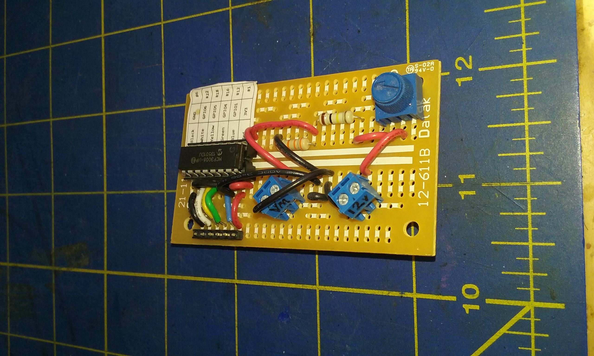

# Send Emails from the Raspberry PI
This is a quick example, in order to present the way to use it in other projects.

### To build it
- Clone the repo as usual.
- Then
```bash
 cd PI4J.email
 ../gradlew --daemon clean shadowJar
```

### Run the example
This shows how to send emails, and how to _listen_ to emails, expecting a special one to stop the program.

The example provided here assumes that you have enabled the camera on the Raspberry PI,
and started the script named `motion.sh` as follow:
```bash
 sudo ./motion.sh &
```
This command takes a snapshot named `snap.jpg` every 10 seconds.

Then, you need to provide your email account(s) information, in a file like
`email.properties.sample`.

Make a copy of this file, named `email.properties`, and provide your account(s) info.
This  [link](http://www.arclab.com/products/amlc/list-of-smtp-and-pop3-servers-mailserver-list.html) might help.

Then you can run the command
```bash
 ./run -send:google -receive:yahoo -sendto:me@home.net,you@somewhere.else
```
This will send several emails to the `google` account (as defined in your `email.properties`), and listen to the emails in the `yahoo` account.
The sent emails will have the `snap.jpg` attached to it.

The program is finally sending an `exit` email, that terminates the program, managed by the `EmailReceiver`.
The first email is a `read-loud` one, that will be read out loud if you have installed `espeak` and connected a loudspeaker on the Raspberry PI.

To install `espeak` on the Raspberry PI:
```
 $ sudo apt-get install espeak
```

### Another example, remote battery monitoring
This project intends to monitor a battery in a remote place (like a boat, an RV, etc) that has a network
connection access though.

You need a small device like the one below:

Fritzing diagram available [here](https://github.com/OlivierLD/raspberry-pi4j-samples/blob/master/ADC/12-volts.monitor.fzz).

Look in the file [ADCReader.java](https://github.com/OlivierLD/raspberry-pi4j-samples/blob/master/PI4J.email/src/samples/ADCReader.java), you can run it from
the script named `runvolt`:
```bash
 ./runvolt -send:google -sendto:me@home.org -loop:24h
```

It will constantly read the battery's voltage, and sent an email every 24 hours, looking like

```
 At Sun Jan 15 11:29:45 PST 2017, voltage was 13.40 Volts.
```

If the battery to monitor is in a location without a network access, then maybe the FONA option is to be considered.
See the `FONA` directory.

