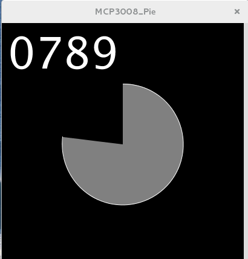
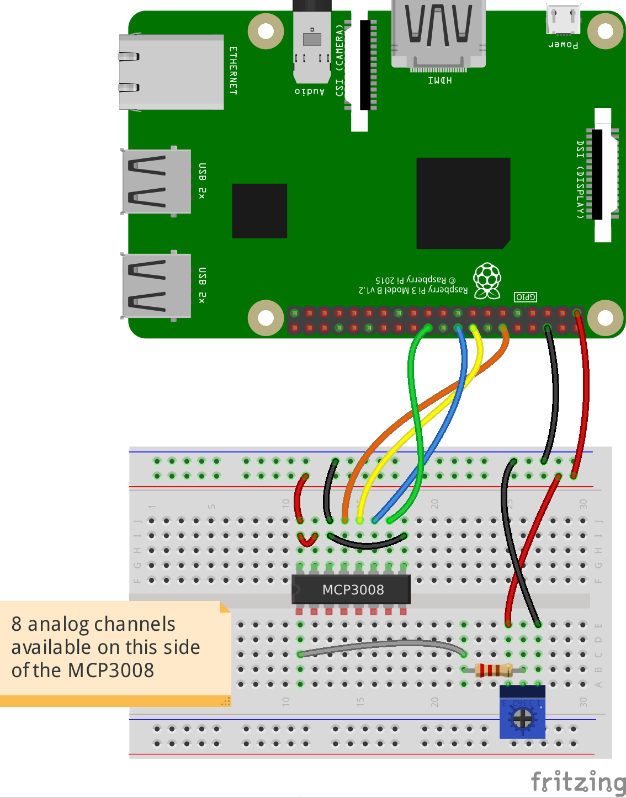
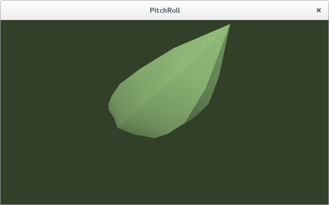
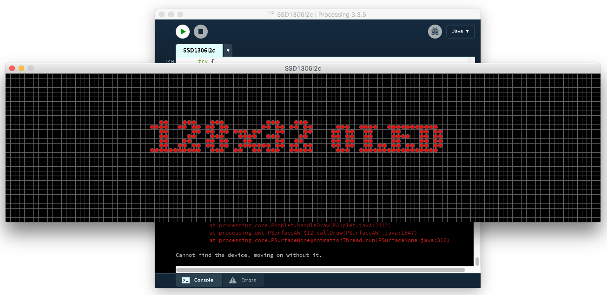
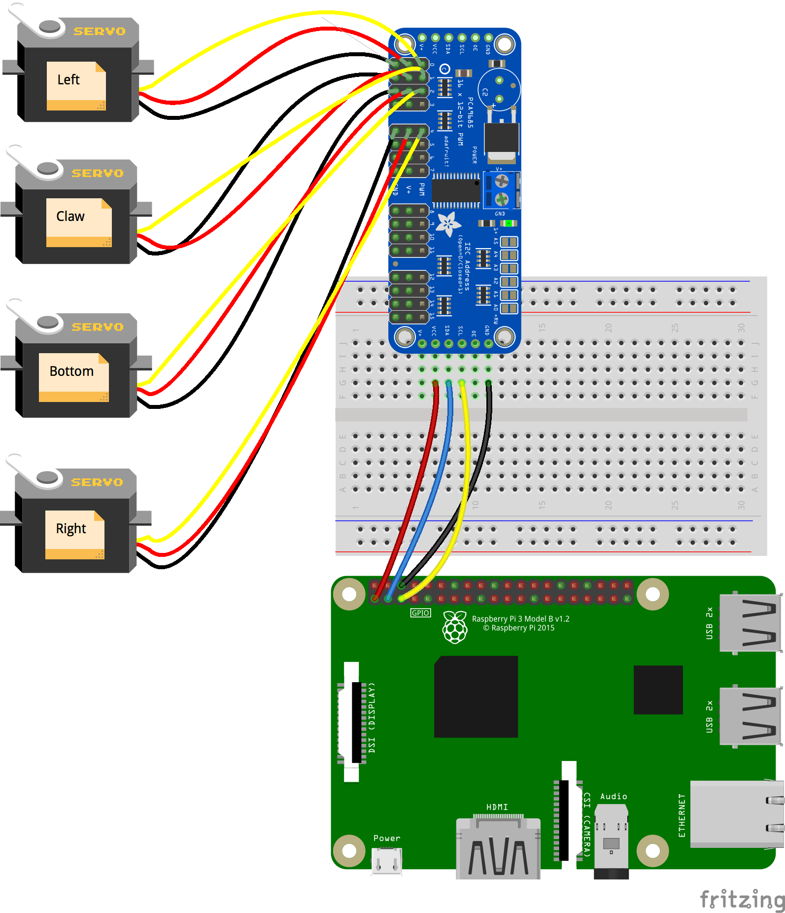

# Processing.org

[Processing](http://processing.org) is a framework that considerably simplifies Java development.

It seems to be compatible with the projects of this repository.

For example, here is the code that graphically displays the value returned by an ADC (MCP3008):
```java
import analogdigitalconverter.mcp3008.MCP3008Reader;
/*
 * Using Sketch > Add File..., select ADC/build/libs/ADC-1.0-all.jar
 */
int value;
int ADC_CHANNEL = MCP3008Reader.MCP3008_input_channels.CH0.ch(); // Between 0 and 7, 8 channels on the MCP3008

void setup() {
  size(200, 200);
  stroke(255);
  noFill();
  textSize(72);  
  MCP3008Reader.initMCP3008();
}
void draw() { // Draw the value of the ADC (MCP3008) at each repaint
  background(0);
  fill(255);
  value = MCP3008Reader.readMCP3008(ADC_CHANNEL);
  text(String.format("%04d", value), 10, 100);
}
```
About 20 lines...

### To run the Sketch
- From the project root, to produce the required jar files, run
```bash
 $> ./gradlew clean shadowJar
```
- Open it in `Processing` (no need to copy it anywhere else)
- If instructed in the comment at the top of the sketch, use the menu `Sketch > Add File...` to select the appropriate archive
- Make sure your wiring is correct.
- Hit the `Run` button in `Processing`.
- Turn the button of the potentiometer, and see for yourself.



The wiring looks like this:


## PitchRoll.pde

Displays the pitch and roll, returned by an LSM303 sensor.

 

## SSD1306 (oled display)

Mirror - synchronously - the display of the SSD1306.




## MeArm

 


----------------------------------------------

And more to come.
