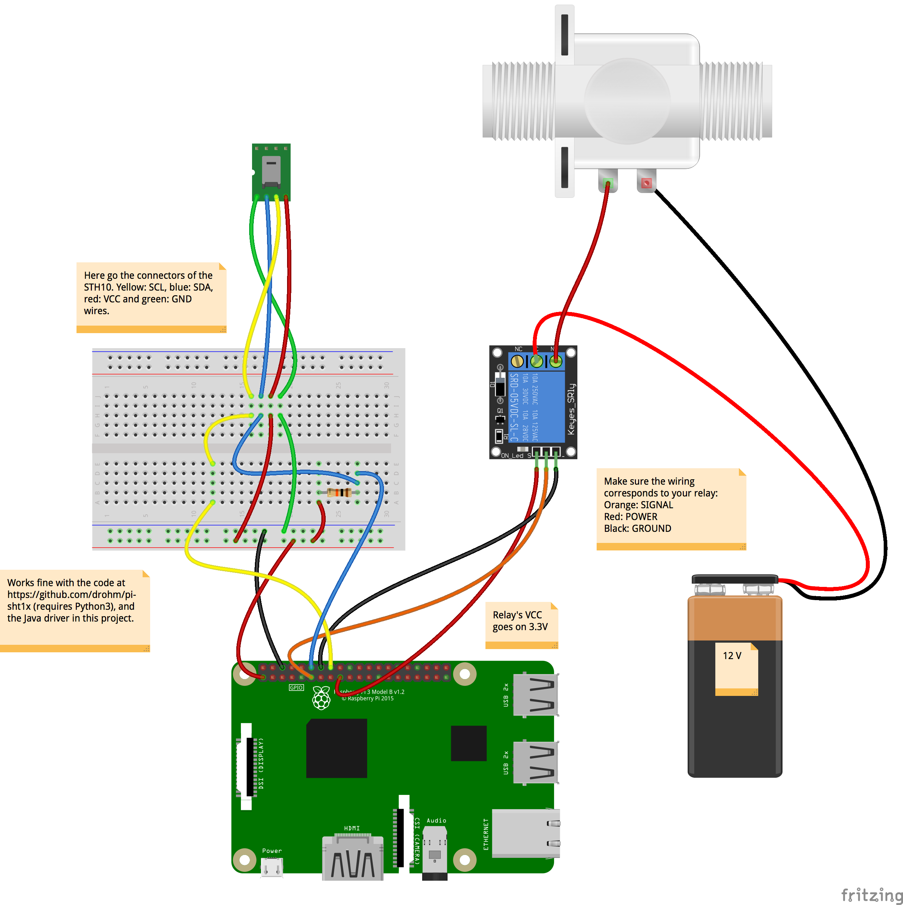
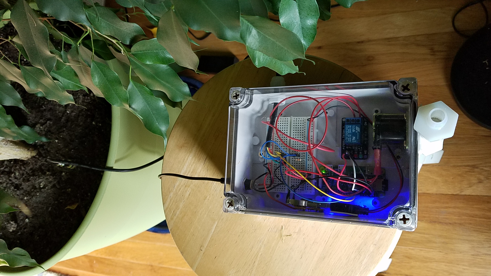
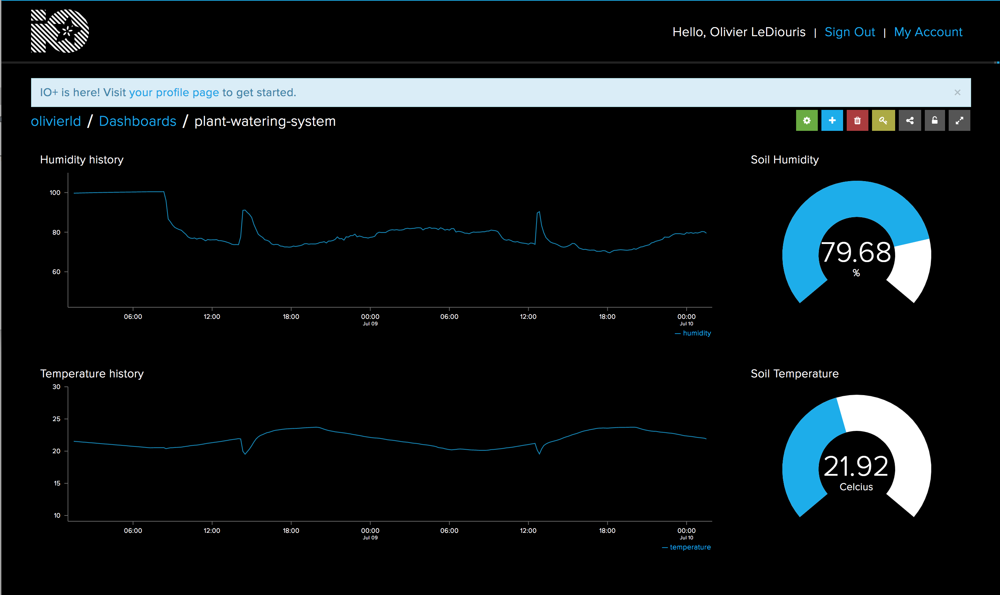
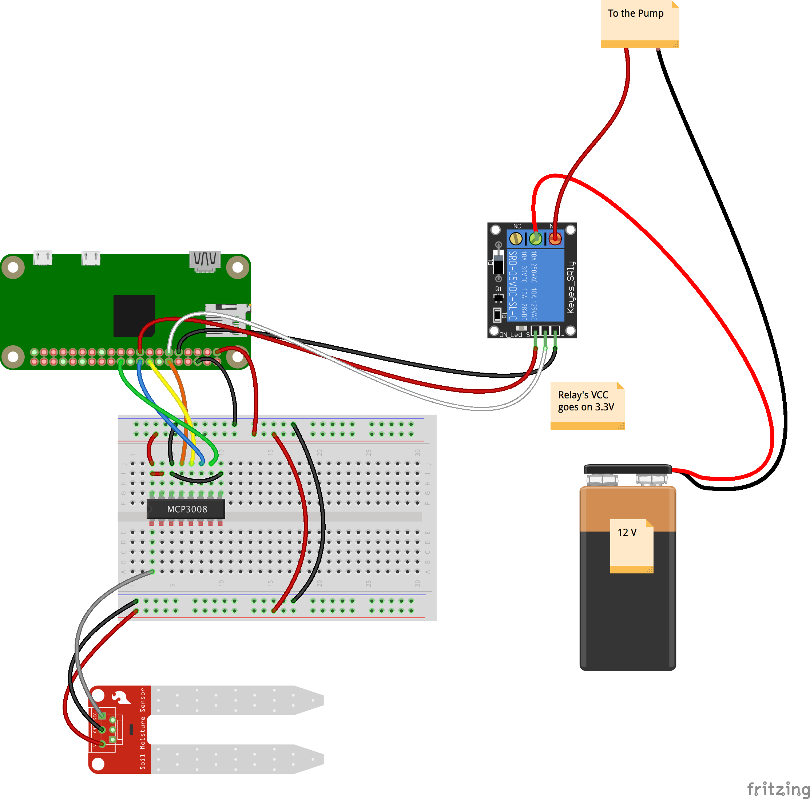

# WIP: Plant Watering System
## A real world project, hardware _and_ software

We want to interface a Moisture/Humidity/Temperature sensor (https://www.adafruit.com/product/1298) with
a solenoid valve (https://www.adafruit.com/product/997), to irrigate the plants in need.

TODO: Try a peristaltic pump: https://www.adafruit.com/product/1150

The `STH10` is a temperature and humidity sensor that can be stuck in the soil next to a plant.
The goal here is to read the humidity of the soil, and to water the plan when the humidity goes below a given threshold.

Watering is done by opening a solenoid valve connected to a tank of water.

#### History, Act 1:  Reading the STH10 Sensor. Getting there...
The goal here is to finally heave a Java implementation of the code. See below.

We start from an Arduino sketch, that can read the STH10.
> _Important note_: The 10 K&Omega; resistor is not to be forgotten.


This produces an output like that:


The idea here is to trigger the valve when the humidity goes below a given threshold.
The valve opens a pipe connected to a tank of water.
As the valve requires a 12 Volt power supply, it will be driven by relay.

On the Raspberry Pi, the code at https://github.com/drohm/pi-sht1x works fine to read the `STH10`, with the following wiring:



---

Inspired from https://github.com/drohm/pi-sht1x and the [STH1x Specs](https://cdn-shop.adafruit.com/datasheets/Sensirion_Humidity_SHT1x_Datasheet_V5.pdf), the Java code is now also available in this project.
It relies on `PI4J`.
See in this project the class named `sensors.sth10.STH10Driver.java`.

> Note on the relay's wiring:
>
> The doc of the relay specifies that it should be fed with a `5V` power supply. This did not work for me on a single relay board.
> (surprisingly, it was working OK on a 2-relay board). The relay goes on when the program is started, does not go down until
> the program terminates with a `gpio.shutdown()`. The reason is that the states `HIGH` and `LOW` is evaluated by
> comparing the power supply with the signal. As the GPIO header of the Raspberry Pi delivers `3.3V`, the comparison with `5V`
> never finds it equal.
>
> Hooking the relay's power supply to `3.3V` fixes the issue, as the comparison with the power supply and the signal find them equals
> when the GPIO pin is `ON`.

---

### Triggering the valve
https://www.adafruit.com/product/997

With a Relay

##### To determine
- The humidity threshold beyond which to start watering
- How long should the watering last
- How long to wait after watering before re-start measurement

### Extras
- IoT and stuff... We'll see.

### Power supply
12 & 5 Volts.
- 5 for the Raspberry
- 12 for the valve

We will have one 12V power supply (I've used [this one](https://www.adafruit.com/product/352), [that one](https://www.adafruit.com/product/798) should fit), and use a car cigarette lighter USB adapter to turn it into 5V.
That seems to be the cheapest approach (< $2.00), and it works well.

### The Hardware
The project box, the tank, the hoses...

### Usage

Run the script named `read.probe.sh`. It contains the program's arguments.

If it is run somewhere else than on a Rapsberry PI, data will be _simulated_.

To see the available program arguments:
```
$ java $JAVA_OPTIONS -cp $CP main.STH10 --help
+---------------------------------------
| Program arguments are:
+---------------------------------------
| --water-below:	Integer. Humidity threshold in %, default is --water-below:50, start watering below this value.
| --water-during:	Integer. In seconds, default is --water-during:10. Duration of the watering process.
| --resume-after:	Integer. In seconds, default is --resume-after:120. After watering, resume sensor monitoring after this amount of time.
| --verbose:	String. Verbose, default is --verbose:NONE, values can be 'NONE', 'STDOUT' or 'ANSI'.
| --data-pin:	Integer. BCM (aka GPIO) pin number of the DATA pin of the sensor. Default is --data-pin:18.
| --clock-pin:	Integer. BCM (aka GPIO) pin number of the CLOCK pin of the sensor. Default is --clock-pin:23.
| --relay-pin:	Integer. BCM (aka GPIO) pin number of the SIGNAL pin of the RELAY. Default is --relay-pin:17.
| --with-rest-server:	Boolean. Default 'false', starts a REST server is set to 'true'
| --http-port:	Integer. The HTTP port of the REST Server. Default is 9999.
| --simulate-sensor-values:	Boolean. Enforce sensor values simulation, even if running on a Raspberry Pi. Default is 'false'. Note: Relay is left alone.
| --loggers:	Comma-separated list of the loggers. Loggers must implement DataLoggerInterface. Ex: --loggers:loggers.iot.AdafruitIOClient,loggers.text.FileLogger
| --logging-pace:	Long, in milliseconds. The interval between each log entry. Default is 10000.
| --help	Display the help and exit.
+---------------------------------------
```

See below the output of a simulated session (see the `UnsatisfiedLinkError`)
```
$ ./read.probe.sh
Usage is ./read.probe.sh [debug]
   Use 'debug' to remote-debug from another machine.
+------- P L A N T   W A T E R I N G   S Y S T E M --------
| Start watering under 50% of humidity.
| Water during 10.000 secs
| Resume sensor watch 30.000 secs after watering.
+----------------------------------------------------------
Wiring:
       +-----+-----+--------------+-----++-----+--------------+-----+-----+
       | BCM | wPi | Name         |  Physical  |         Name | wPi | BCM |
       +-----+-----+--------------+-----++-----+--------------+-----+-----+
       |     |     | 3v3          | #01 || #02 |          5v0 |     |     |
       |  02 |  08 | SDA1         | #03 || #04 |          5v0 |     |     |
       |  03 |  09 | SCL1         | #05 || #06 |          GND |     |     |
       |  04 |  07 | GPCLK0       | #07 || #08 |    UART0_TXD | 15  | 14  |
       |     |     | GND          | #09 || #10 |    UART0_RXD | 16  | 15  |
 RELAY |  17 |  00 | GPIO_0       | #11 || #12 | PCM_CLK/PWM0 | 01  | 18  | DATA
       |  27 |  02 | GPIO_2       | #13 || #14 |          GND |     |     |
       |  22 |  03 | GPIO_3       | #15 || #16 |       GPIO_4 | 04  | 23  | CLOCK
       |     |     | 3v3          | #17 || #18 |       GPIO_5 | 05  | 24  |
       |  10 |  12 | SPI0_MOSI    | #19 || #20 |          GND |     |     |
       |  09 |  13 | SPI0_MISO    | #21 || #22 |       GPIO_6 | 06  | 25  |
       |  11 |  14 | SPI0_CLK     | #23 || #24 |   SPI0_CS0_N | 10  | 08  |
       |     |     | GND          | #25 || #26 |   SPI0_CS1_N | 11  | 07  |
       |     |  30 | SDA0         | #27 || #28 |         SCL0 | 31  |     |
       |  05 |  21 | GPCLK1       | #29 || #30 |          GND |     |     |
       |  06 |  22 | GPCLK2       | #31 || #32 |         PWM0 | 26  | 12  |
       |  13 |  23 | PWM1         | #33 || #34 |          GND |     |     |
       |  19 |  24 | PCM_FS/PWM1  | #35 || #36 |      GPIO_27 | 27  | 16  |
       |  26 |  25 | GPIO_25      | #37 || #38 |      PCM_DIN | 28  | 20  |
       |     |     | GND          | #39 || #40 |     PCM_DOUT | 29  | 21  |
       +-----+-----+--------------+-----++-----+--------------+-----+-----+
       | BCM | wPi | Name         |  Physical  |         Name | wPi | BCM |
       +-----+-----+--------------+-----++-----+--------------+-----+-----+
GPIO> Opening GPIO (sensors.sth10.STH10Driver)
java.lang.UnsatisfiedLinkError: com.pi4j.wiringpi.Gpio.wiringPiSetup()I
GPIO> Will simulate (for sensors.sth10.STH10Driver)
>> Will simulate STH10
GPIO> Provisioning pin BCM #17
java.lang.UnsatisfiedLinkError: com.pi4j.wiringpi.Gpio.wiringPiSetup()I
GPIO> Will simulate pin BCM #17 (for relay.RelayDriver)
>> Will simulate Relay
 T:XX, H:XX > Temp: 20.00 C, Hum: 50.00% (dew pt Temp: 9.28 C)
Temp: 20.00 C, Hum: 50.00% (dew pt Temp: 9.28 C)
Temp: 20.00 C, Hum: 50.00% (dew pt Temp: 9.28 C)
^C
Exiting (Main Hook)
GPIO> Shutting down GPIO from sensors.sth10.STH10Driver: was down already
GPIO> Shutting down GPIO from relay.RelayDriver: was down already
 <- HTTP: Ctrl+C intercepted.
Received an exit signal (path)
Bye from HTTP
Exiting -> Exiting
Simulated temperature between 20.00 and 20.00
Simulated humidity between 50.00 and 50.00
GPIO> Shutting down GPIO from sensors.sth10.STH10Driver: was down already
GPIO> Shutting down GPIO from relay.RelayDriver: was down already
Bye-bye!
Dead.
```

An ANSI version is available:
```
┏━━━━━━━━━━━━━━━━━━━━━━━━━━━━━━━━━━━━━━━━━━━━━━━━━━┓
┃              PLANT WATERING SYSTEM               ┃
┣━━━━━━━━━━━━━━━━━━━━━━━━━━━━━━━━━━━━━━━━━━━━━━━━━━┫
┃ Start watering under 35% of humidity.            ┃
┃ Water during 10.000 secs                         ┃
┃ Resume sensor watch 2 minutes after watering.    ┃
┣━━━━━━━━━━━━━━━━━━━━━━━━━━━━━━━━━━━━━━━━━━━━━━━━━━┫
┃ REST Server on port 1234                         ┃
┣━━━━━━━━━━━━━━━━━━━━━━━━━━━━━━━━━━━━━━━━━━━━━━━━━━┫
┃ Temp: 20.17 C, Hum: 30.23%                       ┃
┣━━━━━━━━━━━━━━━━━━━━━━━━━━━━━━━━━━━━━━━━━━━━━━━━━━┫
┃ Resuming watching in 33.000 secs...              ┃
┗━━━━━━━━━━━━━━━━━━━━━━━━━━━━━━━━━━━━━━━━━━━━━━━━━━┛
```

### Simulation
Can prove useful for testing and calibrating.

There is a REST server that helps sending values to the program
- if you are not on a Raspberry Pi
- if you want to enforce simulation (for tests)

Any REST client does the job. Postman, curl, your own code...

See below (the http port depends on you, see program argument `--http-port:` above)

```
$ curl http://localhost:9999/pws/oplist
[
    {
        "verb": "GET",
        "path": "/pws/oplist",
        "description": "List of all available operations.",
        "fn": {}
    },
    {
        "verb": "GET",
        "path": "/pws/sth10-data",
        "description": "Get device Data. Temperature, humidity",
        "fn": {}
    },
    {
        "verb": "GET",
        "path": "/pws/relay-state",
        "description": "Get relay state - ON of OFF.",
        "fn": {}
    },
    {
        "verb": "POST",
        "path": "/pws/sth10-data",
        "description": "Set device Data. Temperature, humidity, for simulation",
        "fn": {}
    },
    {
        "verb": "PUT",
        "path": "/pws/relay-state",
        "description": "Flip the relay - ON of OFF.",
        "fn": {}
    }
]
```

```
$ curl -H "Content-Type: application/json" -X POST -d '{"temperature":20.17,"humidity":30.23}' http://localhost:9999/pws/sth10-data
```

```
$ curl -X GET http://localhost:1234/pws/sth10-data

{"temperature":20.17,"humidity":30.23}
```

The REST Server is part of this project, it's a very tiny one that runs fine even on the Raspberry Pi Zero.
Details [here](https://github.com/OlivierLD/raspberry-pi4j-samples/blob/master/common-utils/src/java/http/HTTPServer.java), also
see the method `addRequestManager`.

### External access
Vast topic... An option to consider is HTTP, on top of which the REST server mentioned above relies.

This will be fleshed out. Eventually, we will fully drive the device.

For now, try this (from your phone, tablet, whatever): `http://Rasp.pi.add.ress:2345/web/index.html`


The red dot at the top of the page is an activity witness. It blinks red to green and vice-versa whene data are read.

### The real device
First setting:



This one is based on a `Raspberry Pi Zero W`. The probe is in the soil. There is no water tank, and the hoses are not connected (yet). This is doing some data logging for now, to
estimate the right values for humidity.

In the `loggers` package, there are several examples of loggers. One is feeding two `feeds` on `Adafruit-IO`.



### To install
- Flash an SD card with the latest Raspian
- Possibly run
```
 $ sudo apt-get update
 $ sudo apt-get autoremove
 $ sudo apt-get upgrade
 $ sudo apt-get dist-upgrade
```
- Clone the repo and build the application:
```
 $ git clone https://github.com/OlivierLD/raspberry-pi4j-samples.git
 $ cd raspberry-pi4j-samples/Project.Trunk/PlantWateringSystem
 $ ../../gradlew shadowJar
```
- Copy the `rc.local` into the `/etc` directory (careful with that, hey?)
- Use `raspi-config` to change the machine name (like `pws-rpi`)
- Hook up the probe and relay
- Reboot!
- You should be able to reach the Web UI from another machine on the same network.

Another possibility is to start it remotely from `ssh`:
```
 $ ssh pi@192.168.42.17
 ...
 $ cd raspberry-pi4j-samples/Project.Trunk/PlantWateringSystem
 $ sudo -H -u pi nohup ./read.probe.sh &
 $
```

### Next
- NODE-Red Integration ?
- Integration with the NMEA.Multiplexer ?
- Read the `STH10` as an I<small><sup>2</sup></small>C device ?


### January 2019
The `STH10` gives unexpected humidity values when in the soil... always close to 100%.

I'm trying the [SparkFun Soil Moisture Sensor](https://www.sparkfun.com/products/13322) (also available from [WaveShare](https://www.waveshare.com/moisture-sensor.htm))... As it is an analog device, it requires an `ADC`, I'll be using an `MCP3008`.



It does not return the temperature, but it's way less expensive than the `STH10`.

To run the test with the wiring above, run
```
 $ ./sparkfun.cal.sh --miso:23 --mosi:24 --clk:18 --cs:25 --channel:0
 Read an ADC (MPC3008) for 3.3 Volt estimation
 Usage is ./sparkfun.cal.sh --miso:9 --mosi:10 --clk:11 --cs:8 --channel:0
  For miso, mosi, clk & cs, use BCM pin numbers
 Usage is java sensors.sparkfunsoilhumiditysensor.MainMCP3008Sample33 --miso:9 --mosi:10 --clk:11 --cs:8 --channel:0
 Values above are default values (GPIO/BCM numbers).
 
 Reading MCP3008 on channel 0
  Wiring of the MCP3008-SPI (without power supply):
  +---------++-------------------------------------------------+
  | MCP3008 || Raspberry Pi                                    |
  +---------++------+--------------+------+---------+----------+
  |         || Pin# | Name         | Role | GPIO    | wiringPI |
  |         ||      |              |      | /BCM    | /PI4J    |
  +---------++------+--------------+------+---------+----------+
  | CLK (13)|| #12  | PCM_CLK/PWM0 | CLK  | GPIO_18 | 01       |
  | Din (11)|| #18  | GPIO_5       | MOSI | GPIO_24 | 05       |
  | Dout(12)|| #16  | GPIO_4       | MISO | GPIO_23 | 04       |
  | CS  (10)|| #22  | GPIO_6       | CS   | GPIO_25 | 06       |
  +---------++------+--------------+-----+----------+----------+
 Raspberry Pi is the Master, MCP3008 is the Slave:
 - Dout on the MCP3008 goes to MISO on the RPi
 - Din on the MCP3008 goes to MOSI on the RPi
 Pins on the MCP3008 are numbered from 1 to 16, beginning top left, counter-clockwise.
        +--------+ 
 * CH0 -+  1  16 +- Vdd 
   CH1 -+  2  15 +- Vref 
   CH2 -+  3  14 +- aGnd 
   CH3 -+  4  13 +- CLK 
   CH4 -+  5  12 +- Dout 
   CH5 -+  6  11 +- Din 
   CH6 -+  7  10 +- CS 
   CH7 -+  8   9 +- dGnd 
        +--------+ 
        +-----+-----+--------------+-----++-----+--------------+-----+-----+
        | BCM | wPi | Name         |  Physical  |         Name | wPi | BCM |
        +-----+-----+--------------+-----++-----+--------------+-----+-----+
        |     |     | 3v3          | #01 || #02 |          5v0 |     |     |       
        |  02 |  08 | SDA1         | #03 || #04 |          5v0 |     |     |       
        |  03 |  09 | SCL1         | #05 || #06 |          GND |     |     |       
        |  04 |  07 | GPCLK0       | #07 || #08 |    UART0_TXD | 15  | 14  |       
        |     |     | GND          | #09 || #10 |    UART0_RXD | 16  | 15  |       
        |  17 |  00 | GPIO_0       | #11 || #12 | PCM_CLK/PWM0 | 01  | 18  | CLK   
        |  27 |  02 | GPIO_2       | #13 || #14 |          GND |     |     |       
        |  22 |  03 | GPIO_3       | #15 || #16 |       GPIO_4 | 04  | 23  | Dout  
        |     |     | 3v3          | #17 || #18 |       GPIO_5 | 05  | 24  | Din   
        |  10 |  12 | SPI0_MOSI    | #19 || #20 |          GND |     |     |       
        |  09 |  13 | SPI0_MISO    | #21 || #22 |       GPIO_6 | 06  | 25  | CS    
        |  11 |  14 | SPI0_CLK     | #23 || #24 |   SPI0_CS0_N | 10  | 08  |       
        |     |     | GND          | #25 || #26 |   SPI0_CS1_N | 11  | 07  |       
        |     |  30 | SDA0         | #27 || #28 |         SCL0 | 31  |     |       
        |  05 |  21 | GPCLK1       | #29 || #30 |          GND |     |     |       
        |  06 |  22 | GPCLK2       | #31 || #32 |         PWM0 | 26  | 12  |       
        |  13 |  23 | PWM1         | #33 || #34 |          GND |     |     |       
        |  19 |  24 | PCM_FS/PWM1  | #35 || #36 |      GPIO_27 | 27  | 16  |       
        |  26 |  25 | GPIO_25      | #37 || #38 |      PCM_DIN | 28  | 20  |       
        |     |     | GND          | #39 || #40 |     PCM_DOUT | 29  | 21  |       
        +-----+-----+--------------+-----++-----+--------------+-----+-----+
        | BCM | wPi | Name         |  Physical  |         Name | wPi | BCM |
        +-----+-----+--------------+-----++-----+--------------+-----+-----+
 
 Volume: 071% (0736) => 2.374 V
 Volume: 069% (0710) => 2.290 V
 Volume: 008% (0086) => 0.277 V
 Volume: 087% (0896) => 2.890 V
 Volume: 051% (0529) => 1.706 V
 Volume: 032% (0334) => 1.077 V
 Volume: 026% (0273) => 0.881 V
 Volume: 043% (0443) => 1.429 V
 Volume: 066% (0678) => 2.187 V
 Volume: 033% (0340) => 1.097 V
 Volume: 087% (0896) => 2.890 V
 Volume: 054% (0559) => 1.803 V
 Volume: 041% (0422) => 1.361 V
 Volume: 032% (0332) => 1.071 V
 Volume: 067% (0690) => 2.226 V
 Volume: 016% (0173) => 0.558 V
 Volume: 048% (0496) => 1.600 V
 Volume: 061% (0627) => 2.023 V
 Volume: 026% (0275) => 0.887 V
 Volume: 072% (0741) => 2.390 V
 Volume: 058% (0596) => 1.923 V
 Volume: 037% (0386) => 1.245 V
 Volume: 017% (0177) => 0.571 V
 Volume: 048% (0499) => 1.610 V
 Volume: 065% (0668) => 2.155 V
 Volume: 034% (0351) => 1.132 V
 ^C
 Shutting down.
 Bye, freeing resources.
 Done.

 
 
```

#### The valve
Can be replaced by a [peristaltic pump](https://www.adafruit.com/product/1150), that will not require a tank to be _above_ the valve.
Might be easier to use.

More to come soon.

---
