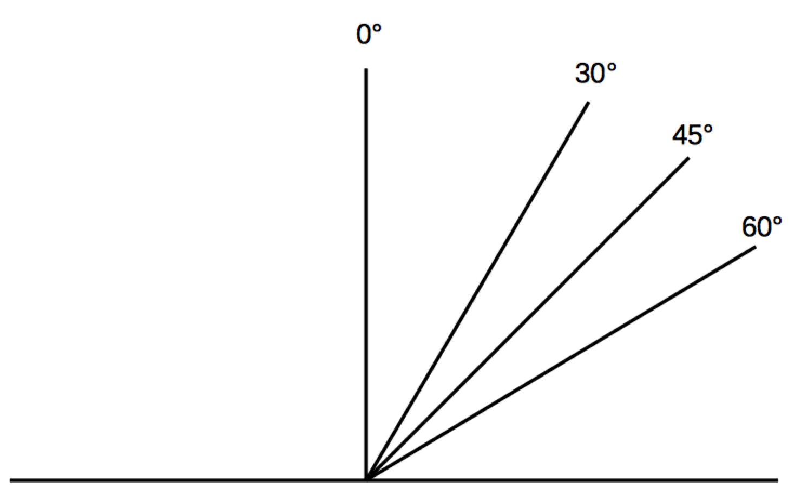
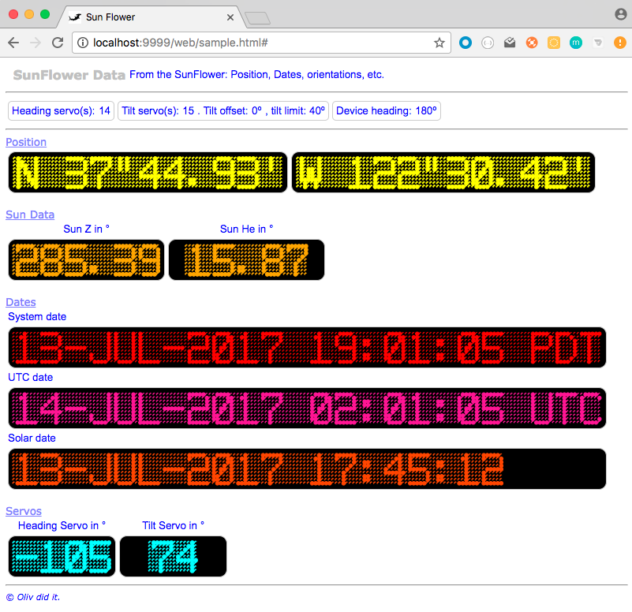
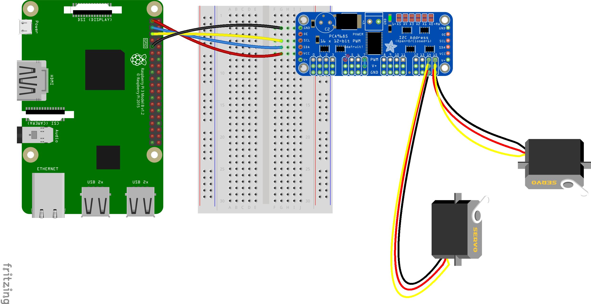
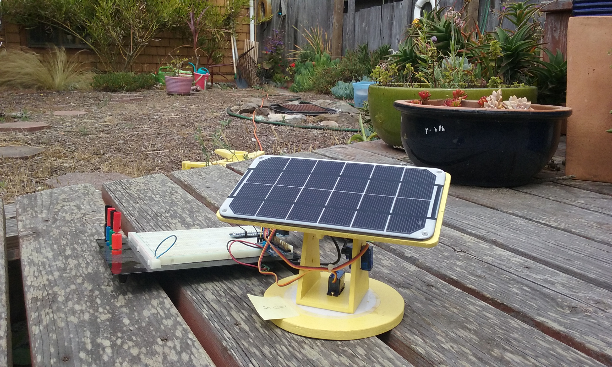
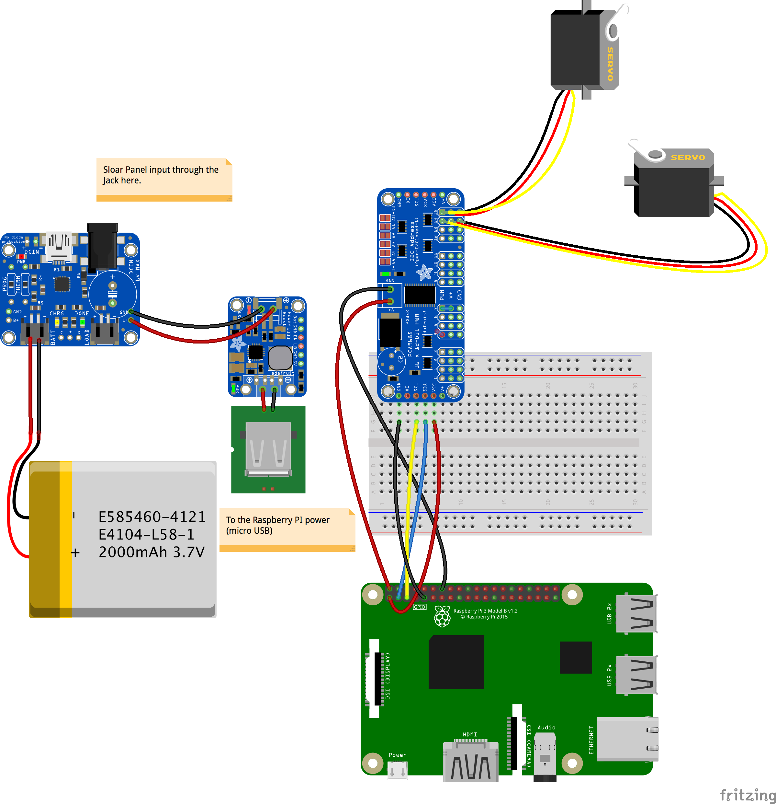

## Sun Flower project, Servos and Sun.

The original idea is to build a device with 2 standard servos to orient a solar panel (like [that one](https://www.adafruit.com/product/200) or similar) so it faces the Sun (90 degrees incidence) whenever possible (ie during the day).

The energy produced by a solar panel is proportional to the cosinus of the incidence angle.
In the same light conditions, a panel with an incidence of 0 degrees (normal) produces _twice_ the amount of energy generated by the same panel with an light incidence of 60 degrees.

```
 cos(0)  = 1
 cos(30) = 0.866
 cos(45) = 0.707
 cos(60) = 0.5
```

<!--  -->


And this applies to the two dimensions, tilt, and heading. Orienting the panel so
it faces the Sun can definitely make a substantial difference in the output.


In this version, the servos are driven by a `PCA9685` board.

For a given position (provided, or read from a GPS), the position of the Sun is calculated, and then its altitude and azimuth.
The servos are triggered when necessary, for the calculated azimuth and elevation to match the orientation of the panel.

By default, in the northern hemisphere, the device would point due South, and the servo angles would be set from there.
Heading and Position can be dynamically provided (in case the device is moving, in a car, a boat, etc) to the class named
`orientation.SunFlower`.

Originally, I had attached an `LSM303` (magnetometer and accelerometer), but it was too close to the servos. Those guys are electro-magnets, this was driving the `LSM303` crazy...

---
<!--
Requires resources from other projects, for the celestial calculations:

Check out this one: https://github.com/OlivierLD/oliv-soft-project-builder

Build it as instructed.

Then you need to do those things to `install` the nautical almanac components in your local Maven repository:

```bash
 $ cd olivsoft
 $ cd javanauticalalmanac
 $ ../../gradlew clean build install
 $ cd ../geomutils
 $ ../../gradlew clean build install
```

After that, the build of this project should work:
-->
### To build the project:
```bash
 SunFlower $ ../gradlew clean shadowJar
```
You can test the Almanac behavior by running
```bash
 $ ./run.test.sh
 -- Sun Jan 01 00:00:00 PST 2017, Mean:23.43708019254589, True:23.434571047530458, Aries GHA:221.1648583732534
    Polaris D:89.33854067501603, Z:177.55048918730466
    Sun Decl:-22.971192378129572
 -- Mon Jan 02 00:00:00 PST 2017, Mean:23.437079836510872, True:23.43458374014393, Aries GHA:222.1505096811722
    Polaris D:89.33860948623546, Z:178.5428345983678
    Sun Decl:-22.882681316884316
 -- Tue Jan 03 00:00:00 PST 2017, Mean:23.43707948047587, True:23.43459523846336, Aries GHA:223.13615195993353
    Polaris D:89.33867311474917, Z:179.53542352222394
    Sun Decl:-22.786581536003055
 -- Wed Jan 04 00:00:00 PST 2017, Mean:23.437079124440857, True:23.434603645974125, Aries GHA:224.12178723691673
...
 From 37°44.93'N / 122°30.42'W, at 19:23:55 UTC, He:72.44º, Z:142.37º (true)
```

<!--
### Issues
The LSM303 returns both magnetic and gravity data.
There seems to be a problem with the heading when pitch and/or roll are not equal to zero (ie when the board is not lying flat).
-->

## Tests
To run a first version of the program, start the script named `run.sh` with the `resthttp` argument:
```bash
 $ ./run.sh resthttp
```
This runs the class named `orientation.SunFlower`.

This class takes the following parameters and system variables:
```
System variables:

 -Dlatitude=37.7489
 -Dlongitude=-122.5070
 -Dtest.servos=true
 -Dorient.verbose=true
 -Dastro.verbose=true
 -Dservo.verbose=true
 -Dservo.super.verbose=true
 -Dansi.console=true
 -Dmanual.entry=true

 -Dheading.servo.sign=-1
 -Dtilt.servo.sign=-1

 -Dtilt.limit=10

 -Dsmooth.moves=true

 -Ddemo.mode=true
 -Dfrom.date=2017-06-28T05:53:00
 -Dto.date=2017-06-28T20:33:00

 -Dhttp.port=9999
 -Dinteractive=false

Program parameters, to change the servo numbers on the PCA9685:
 --heading:14 --tilt:15
```
_Note_:
The `--heading:` and `--tilt:` parameters can be comma-separated lists of numbers (servo channel IDs on the `PCA9685`). Useful when you want to drive several devices, each of them using two servos.
 For example
 ```
 --heading:14,10 --tilt:15,11
 ```

The variables `heading.servo.sign` and `tilt.servo.sign` can be set to `-1`, to invert the way the servos turn. This depends on the physical construction of your device, namely,
is the tilt servo pointing left or right, is the heading servo pointing up or down?

Also depending on the construction of the device, maybe a 90 degrees tilt will not be possible, maybe the panel cannot be tilted more than - say - 75 degrees.
In this case, use the `-Dtilt.limit` system variable. If you set it to `15` for example, that would mean that even if the _Sun's altitude_ is below 15 degrees, the panel
will not be tilted further down.

First, the program sets the `heading` servo to zero, and asks you to point it South (if you are in the northern hemisphere, that would be North otherwise).

Once this is done, Sun's position is calculate every second, and the 2 servos are driven to point to it, as long as the Sun it up (elevation greater than 0°).

Set `interactive` to false to avoid the program asking the user to orient the device before beginning to work. Useful in batch mode.

If the `http.port` variable is here and greater than 0, an HTTP Server - with REST Services - is started, and can be reached from any REST Client. A Web page is provided, as an example,
`web/index.html`.

Here is an example of a REST request, that returns the list of available operations:
```
 $> curl http://192.168.42.1:9999/oplist
 [
     {
         "verb": "GET",
         "path": "/oplist",
         "description": "List of all available operations.",
         "fn": {}
     },
     {
         "verb": "GET",
         "path": "/position",
         "description": "Get device position on Earth.",
         "fn": {}
     },
     {
         "verb": "GET",
         "path": "/device-heading",
         "description": "Get device heading.",
         "fn": {}
     },
     ...

```

And this is a snapshot of the sample page mentioned above, the "led" sections can be collapsed or expanded:
<!--  -->


## Inversion
Standard servos like the `SG92R` (and many - if not all - others) rotate on 180 degrees, from -90° to 90°.

That could fit if the body to target (ie the Sun) was going for example from East to West, through South. Unfortunately,
this is not the case.

For example, from San Francisco, on Wed June 21, 2017:
```
At N  37°44.96' / W 122°30.44'
Sun Rise:21 Jun 2017 05:52 (PDT -0700) (Z= 59°)
Sun Set :21 Jun 2017 20:31 (PDT -0700) (Z=301°)
```
The Sun rises in the 59°, and sets in the 301°. Azimuth 59° translates into a servo angle of -121°, and azimuth 301° into a servo angle of 121°; -121° and 121° are far out of `[-90°..90°]`.


This is where we need to invert the angles.

Let's take this example, it is a summer morning in the northern hemisphere, the azimuth of the Sun is smaller than 90.


The angle of the servo goes beyond limit, it cannot be set.
A solution is to point in the opposite direction, and flip the tilt servo:


This is a static situation, from the northern hemisphere.
The device can also be on the go, the code can receive the position and the heading (from a GPS or an NMEA station for example) at any time, it will adjust the servos accordingly.

## Wiring
<!--  -->


> _Note_: If you want to power the `PCA9685` from the Raspberry Pi (5v, GND), you need a power outlet that feeds around 1A.
> If you see the Raspberry Pi constantly rebooting itself, it is very likely to be a power issue, you do not feed it enough.

Like here:


_Note_: The diagram above features a Raspberry Pi 3, but they all work well, including the Raspberry Pi Zero.

## At work
A snapshot of the (optional) ANSI console (look into the script named `run` for details):
```bash
 $> ./run.sh smooth
```


Here is a prototype, made of plexiglass and adhesive tape:<br>
<!--  -->

<br> Next comes the real stuff!

Here is <a href="https://youtu.be/apTLJXE4vUk" target="UTube">a video</a>, one day simulation, featuring the inversion function at work.

## The real setting
This one is made out of plywood. My 3D printer is a jigsaw ;)

Here is the device at work:

Aligment

At work


To store - and reuse - the energy generated by the panel, I got some inspiration from [here](https://learn.adafruit.com/solar-boost-bag).

> It is possible to have a completely autonomous setting, (the Raspberry Pi powered from the LiPo battery
the solar panel is charging) but it is important to have the required output. I use the [PowerBoost 1000 Charger](https://www.adafruit.com/product/2465) from Adafruit, the
500 version turned out not to be powerful enough, the Raspberry Pi was rebooting every time a servo was solicited (hence problem).
All is good with the 1000.



## NMEA Feed
From the project `NMEA.multiplexer`, wrap the `SunFlower` class into a `forwarder`.
This way, position and heading come from an NMEA channel (log file, NMEA Station, TCP Channel, etc), and
_forwarded_ to the `SunFlower`.

This gives the possibility to have the same orientation features, even if the panel(s) is(are) carried by a vehicle in motion.
Requires a damping on the heading values (to avoid all the energy gathered by the solar panel to be wasted in
shaking the heading servo).
> _Note_: It is the `heading` that is required here, not only the Course Over Ground (`COG`), returned by the GPS.
> In the sample implementation of `GPS.sun.servo` mentioned below, this is why we use an `LSM303` (magnetometer), that will return the heading,
> even if the device is not in motion; `COG` requires motion, as it is calculated between the current and previous positions.

See the project named `GPS.sun.servo`.

# ADC Monitoring
Monitor the load of the LiPo battery, with an MPC3008.

Add a photocell(s) (read by the MCP3008 as well), to know how sunny it is.


-----

## Next

- Try a "direct" servo approach, without a PCA9685.

- Orienting much bigger panels, using *stepper motors*, worm gears, etc.
    - For this last one, the challenge will be to know what the angles set by the motors are.
        - A way to do it would be to use linear potentiometers and ADCs (like MCP3008).

---
