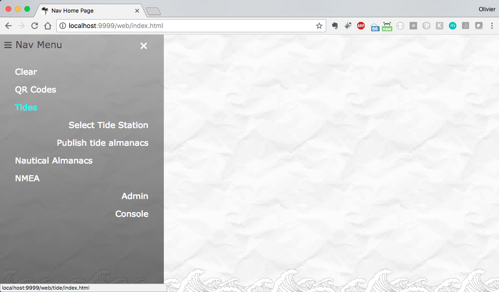
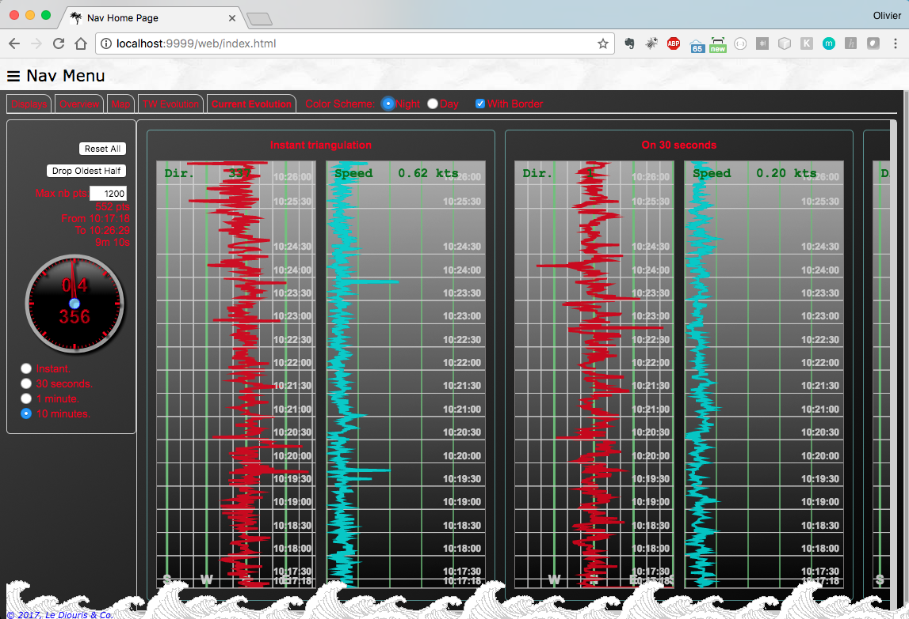
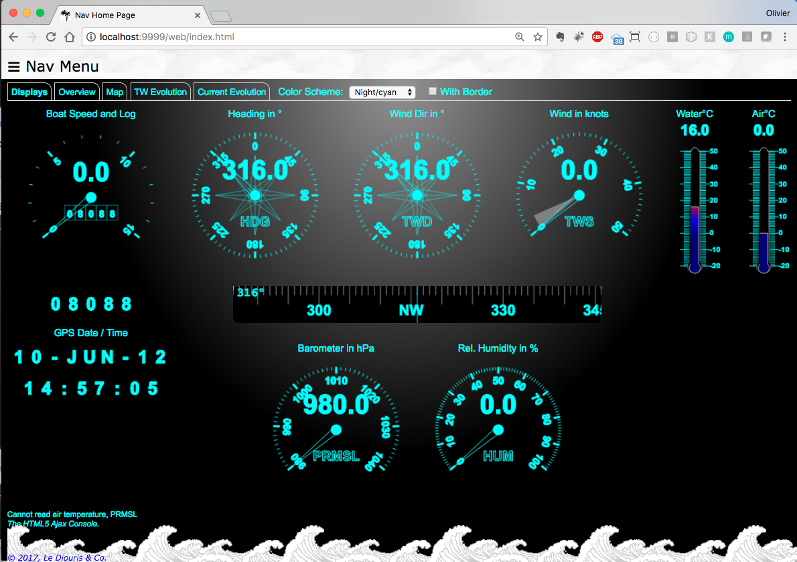
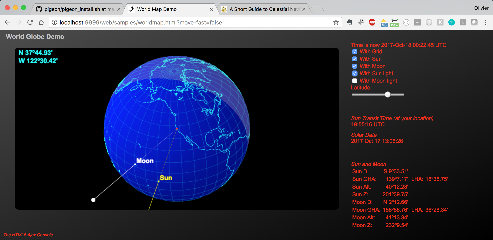
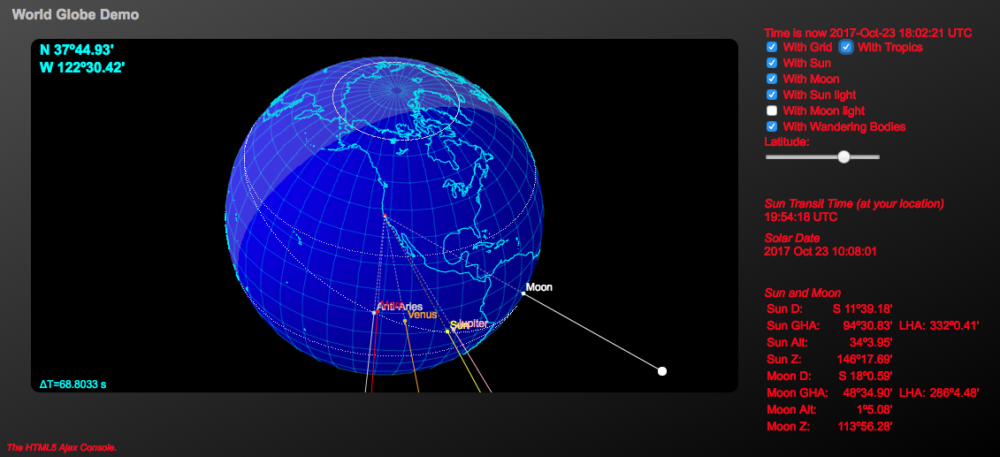
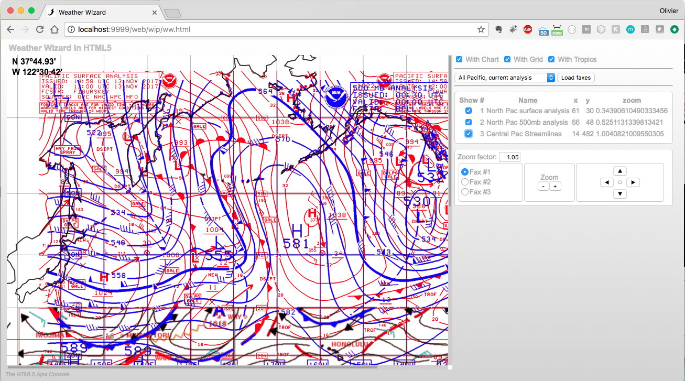

# Navigation Server

An illustration of the way to gather several REST Services all in one place.
This project is an extension/prolongation of the [NMEA Multiplexer](https://github.com/OlivierLD/raspberry-pi4j-samples/blob/master/NMEA.multiplexer/README.md).

- [Tide](https://github.com/OlivierLD/raspberry-pi4j-samples/blob/master/RESTTideEngine/README.md) REST Service
- [Astro](https://github.com/OlivierLD/raspberry-pi4j-samples/tree/master/RESTNauticalAlmanac) REST Service
- [NMEA Multiplexer](https://github.com/OlivierLD/raspberry-pi4j-samples/blob/master/NMEA.multiplexer/README.md) REST Service
- ... and the list keeps growing (see in `navrest.NavServer.java` how to add a `RequestManager`).

In addition, I'll be attempting to implement the features of the Weather Wizard (another project I own, in Java and Swing, that can superimpose different heterogeneous documents on the same chart, like Faxes, GRIBS, routing results, etc.). This part involves the
`Img` REST Service, found in the [`RESTImageProcessor`](https://github.com/OlivierLD/raspberry-pi4j-samples/tree/master/RESTImageProcessor) project, and the routing features, found in the [`RESTRouting`](https://github.com/OlivierLD/raspberry-pi4j-samples/blob/master/RESTRouting/README.md) project.

### Rationale

The idea here is _not_ to display _any_ Graphical User Interface (GUI) on the Raspberry PI, where the server is running.
The GUI is dedicated to `HTML5` and `CSS3`, rendered in the browser of any device connected to the Raspberry PI's network (laptop, tablet, smartphone, etc).

An application like `OpenCPN` seems (to me) too demanding for the Raspberry PI. Same for all `Swing` applications
developed in Java. And actually, this is a general trend in this area, languages like Java are clearly moving to the back-end side of the story.
Java applets are being de-supported in more and more browsers, HTML and connected technologies keep improving
their graphical capabilities (see [WebGL](http://learningwebgl.com/blog/), really [amazing](http://arodic.github.io/p/jellyfish/)).

For inspiration, check out sites like [CodePen](https://codepen.io/)...

> Just to nail it down: we've all used Integrated Development Environments (IDE), considering that this is (or was) where
> client side processing capabilities were needed.
> Well, think again, and look at what [Cloud9](http://c9.io/) is capable of...

Learning how to use graphical libraries (like `Swing`, `JavaFX`, and others) is not an easy task,
it is demanding, it is long, and there is no standard way to do it. For example, moving from `Swing` to `JavaFX` or `SWT` pretty much requires
a full re-write of your application.

I'd rather spend time learning how use HTML5's canvases, or WebGL.

> This project has two distinct aspects:
> - REST services written in Java, running on the Raspberry PI (or any other machine)
> - Web pages, to be rendered on any device that can reach the Raspberry PI's network

The sample web pages presented below are relying on HTML5 and CSS3.

#### Two languages?
This clearly divides the problem to address in two distinct parts:
- Back end computation, providing the data to render in some agnostic format like `json` or `XML` (we'll use `json` here), exposed as REST services.
- Front end rendering, consuming the data provided by the back end to display them in a Graphical User Interface (GUI).
- The broker (the glue) in-between is relying on the HTTP protocol.

This allows pretty much _any_ device that knows about a network to connect to the Local Area Network (LAN)
created by the Raspberry PI (or any machine the server runs on) to connect to it and consume the data it produces.

The way to go for the front end is - at least for now - quite obvious, it is the combination of HTML5, CSS3, and JavaScript.
Consuming REST services can be done from many frameworks, here we'll use `jQuery`, for its `Promise` (aka `Deferred`) features.
> The `Promise` aspect might go away, once `EcmaScript6` is more widely supported (in the browsers; it currently requires a transpilation).

For the back end, my current choice would be to go for a Java Virtual Machine (JVM) supported language, like Java (this is by far not the only JVM-supported language, see Scala, Groovy, Clojure...), mostly for portability
and re-usability reasons. I have several other projects (not necessarily dedicated to the Raspberry PI) writen in Java; a `jar` (JAva Archive) generated from those projects can be part of any
Raspberry PI project as long as it runs on a JVM.
But other options could be considered, the most prominent one being probably `nodejs`. This could be quite interesting too, as the same language could be used to write the
Front End _and_ the Back End.

Something to think about.

Also, the emergence of container techniques like `Docker` opens the door to other languages, like `Golang`. What's said above about re-usability remains, but this might also be something to take a look at.

Anyway! For now, the back-end is running on a JVM.

## Try it
Build it:
```bash
 $ ../gradlew [--no-daemon] shadowJar
```

Then run the server
```bash
 $ ./runNavServer
```

Finally, use `Postman`, any `REST` client, or your browser, and reach
```
 GET http://localhost:9999/oplist
```

You will see it displays operations from three services.

## Use it

The web pages mentioned below are provided _as examples_ of the way to consume the REST services provided on the Raspberry PI.
The snapshots might be a little obsolete, this iks a work in porigress, constantly evolving.
But this will give you an idea.

From _any_ device (laptop, tablet, smart-phone) that can run a browser, reach this url:
```
 http://[host]:9999/web/index.html
```
> `[host]` is the name or IP of the machine the server runs on.

_Your browser needs to support `HTML5` and `CSS3`, but nowadays, less and less browsers do not._

Then you are able to:
- See the Navigation Console
- Publish Nautical Almanacs
- Visualize Tide Curves
- etc.



The menu is accessible from the hamburger at the top left.

In addition, as we are using the `NMEA Multiplexer` (see this project), you can read pretty much any
NMEA data source, compute and transform then, and rebroadcast then on any channel you like, to enable other devices and programs
to read them (`OpenCPN`, `SignalK`, etc) .


NMEA Console. The displays (night theme).



Evaluation of the current, instantaneous, 30 seconds.


Evaluation of the current, 1  minute, 10 minutes, _much more_ accurate!



All CSS driven, it's very easy to create your own stylesheet. The screenshot above involves the exact same components as in then other screenshots.


Actual position, in real time. With sunlight and moonlight options.

---





The 3D map - beside being an interesting trigonometric exercise - is pinging the REST Astro Service
to get the real time coordinates of the Sun and the Moon, to display them on the globe.

---

## Notice
> Notice that the `RESTImplementation` only concerns `one` resource, `/oplist`.
> All the others come from different projects.
>
> Everything is pulled together by the build (`shadowJar` aggregates everything in only one jar file).
> The biggest part of this project will be the web pages, served by the same HTTP server as the REST services.

---

## Various features

**Weather Wizard**:



> A quick note on the Weather Wizard: The faxes can be downloaded from the Internet, from the NOAA web site or its equivalents. At sea, SailMail does the job,
> I heavily tested it, it does work.
>
> Now, to be able to superimpose faxes as above, you need 2 main things:
> - turn the white background of the fax into a transparent color
> - change the black foreground color (in case we deal with a black and white fax) into something else, for better reading.
>
> I was not able to find a way to do this in JavaScript (JavaScript in the browser, hey, some `nodejs` library do it, but they run on a server side - aka dark side).
> That's where the `RESTImageProcessor` comes in. This is the one transforming the images (faxes) into what's expected.
>
> Again, all this runs _fine_ on a Raspberry PI Zero.


Faxes and GRIB, together

## Server Remote access
> See [this document](https://github.com/OlivierLD/raspberry-pi4j-samples/tree/master/NMEA.multiplexer#remote-access).

## TODOs, next...

- `npm` for non-java resource sharing
- Minify JavaScript resources
- GRIB rendering (in full), coming good.
- Routing features
- Use the GRIBs available through [Outernet](https://outernet.is/) (Need more thoughts...) ?
- Implement visual widgets as `web-components` (see [here](https://github.com/OlivierLD/raspberry-pi4j-samples/tree/master/oliv.scratch.pad/some.tests/web-components-playground/oliv-components))...

