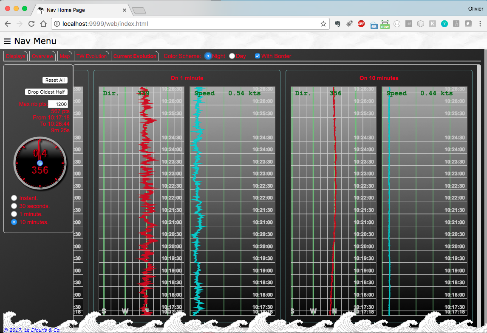

# Navigation Server

An illustration of the way to gather several REST Services all in one place.

- Tide REST Service
- Astro REST Service
- NMEA Multiplexer REST Service

## Try it
Build it:
```bash
 $ ../gradlew shadowJar
```

Then run the server
```bash
 $ ./runNavServer
```

Finally, use `Postman`, any `REST` client, or your browser, and reach
```
 http://localhost:9999/oplist
```

You will see it displays operations from three services.

## Use it

From _any_ device (laptop, tablet, smart-phone) that can run a browser, reach this url:
```
 http://[host]:9999/web/index.html
```
> `[host]` is the name or IP of the machine the server runs on.

Then you are able to:
- See the Navigation Console 
- Publish Nautical Almanacs
- Visualize Tide Curves
- etc.

In addition, as we are using the `NMEA Multiplexer` (see this project), you can read pretty much any
NMEA data source, compute and transform then, and rebroadcast then on any channel you like, to enable other devices and programs
to read them (`OpenCPN`, `SignalK`, etc) .


NMEA Console. The displays (night theme).


Current evaluation, instantaneous, 30 seconds.



Current evaluation, 1  minute, 10 minutes, much more accurate!

---

## Notice
> Notice that the `RESTImplementation` only concerns `one` resource, `/oplist`.
> All the others come from different projects.
>
> Everything is pulled together by the build (`shadowJar` aggregates everything in only one jar file).
> The biggest part of this project will be the web pages, served by the same HTTP server as the REST services.

---

## TODO

- Previous Next on the tide
- Globe display for Earth
- `npm` for non-java resource sharing

