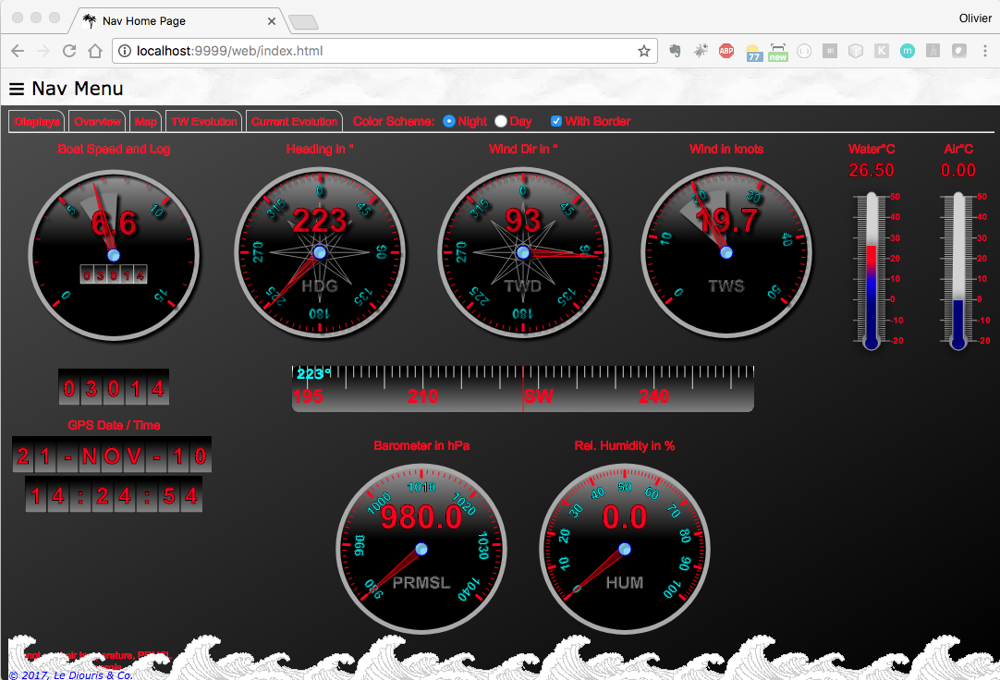

# Navigation Server

An illustration of the way to gather several REST Services all in one place.

- [Tide](https://github.com/OlivierLD/raspberry-pi4j-samples/blob/master/RESTTideEngine/README.md) REST Service
- [Astro](https://github.com/OlivierLD/raspberry-pi4j-samples/tree/master/RESTNauticalAlmanac) REST Service
- [NMEA Multiplexer](https://github.com/OlivierLD/raspberry-pi4j-samples/blob/master/NMEA.multiplexer/README.md) REST Service

The idea here is _not_ to display _any_ Graphical User Interface (GUI) on the Raspberry PI, where the server is running.
The GUI is dedicated to `HTML5` and `CSS3`, rendered in the browser of any device connected to the Raspberry PI's network (laptop, tablet, smartphone, etc).

An application like `OpenCPN` seems (to me) too demanding for the Raspberry PI. Same for all `Swing` applications
developed in Java. And actually, this is a general trend in this area.
Java applets are being de-supported in more and more browsers, HTML and connected technologies keep improving
their graphical capabilities (see [WebGL](http://learningwebgl.com/blog/), really [amazing](http://arodic.github.io/p/jellyfish/)).

Learning how to use graphical libraries (like `Swing`, `JavaFX`, and others) is not an easy task,
it is demanding, it is long, and there is no standard way to do it. For example, moving from `Swing` to `JavaFX` or `SWT` pretty much requires
a full re-write of your application.

I'd rather spend time learning how use HTML5's canvases, or WebGL.

The sample web pages presented below are relying on HTML5 and CSS3.

## Try it
Build it:
```bash
 $ ../gradlew shadowJar
```

Then run the server
```bash
 $ ./runNavServer
```

Finally, use `Postman`, any `REST` client, or your browser, and reach
```
 http://localhost:9999/oplist
```

You will see it displays operations from three services.

## Use it

From _any_ device (laptop, tablet, smart-phone) that can run a browser, reach this url:
```
 http://[host]:9999/web/index.html
```
> `[host]` is the name or IP of the machine the server runs on.

Then you are able to:
- See the Navigation Console 
- Publish Nautical Almanacs
- Visualize Tide Curves
- etc.

In addition, as we are using the `NMEA Multiplexer` (see this project), you can read pretty much any
NMEA data source, compute and transform then, and rebroadcast then on any channel you like, to enable other devices and programs
to read them (`OpenCPN`, `SignalK`, etc) .



NMEA Console. The displays (night theme).


Current evaluation, instantaneous, 30 seconds.


Current evaluation, 1  minute, 10 minutes, much more accurate!


Actual position, in real time. With sunlight and moonlight options.

---


The 3D map - beside being an interesting trigonometric exercise - is pinging the REST Astro Service
to get the real time coordinates of the Sun and the Moon, to display them on the globe.

---

## Notice
> Notice that the `RESTImplementation` only concerns `one` resource, `/oplist`.
> All the others come from different projects.
>
> Everything is pulled together by the build (`shadowJar` aggregates everything in only one jar file).
> The biggest part of this project will be the web pages, served by the same HTTP server as the REST services.

---

## TODO

- `npm` for non-java resource sharing

