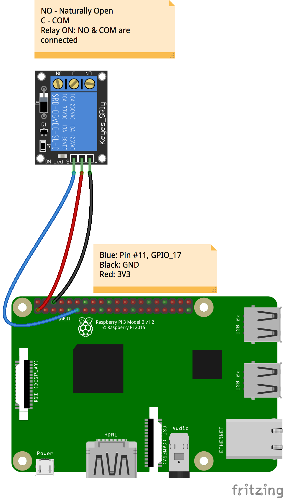
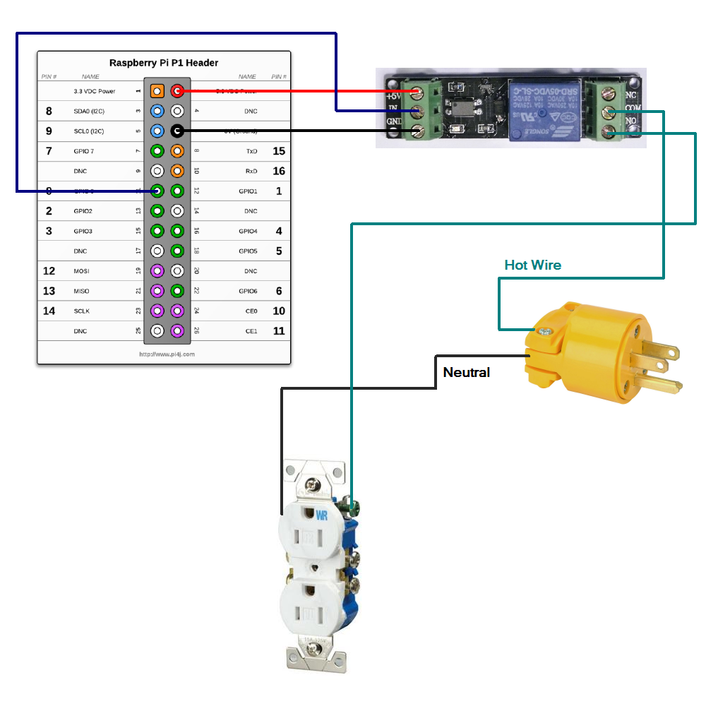

## REST Relay
Simple example showing:
- How to interact with a Relay
- How to expose the relay to a REST Server
- How to interact with the REST Server to turn the relay on or off
  - From a Web Client
  - A Smart Watch
  - An ESP8266

---

### Wiring


Wiring between the Raspberry Pi and the Relay.



How to hook up the power to the relay.

### Relay mapping
The code in this project can drive several relays.

The limit is the number of GPIO pins available on the Raspberry Pi header.

The relays will be identified by an integer.

The `RelayRequestManager` will establish the mapping between the relay number (`id`) and
the GPIO pin driving it. The "map" is provided as a System Property provided at runtime:

```
 -Drelay.map=1:11,2:12
```

The variable is made of elements `ID:PIN` separated by a comma.

The `PIN` is the **physical** number of the pin.

The semantic is the following one:
```
  -Drelay.map=1:11,2:12
              | |  | |
              | |  | Physical pin #12 (GPIO_1)
              | |  Relay num for this app
              | Physical pin #11 (GPIO_0)
              Relay num for this app
```

#### Header
See below:

The pin #11 is BCM 17, and GPIO_0.

```
       +-----+-----+--------------+-----++-----+--------------+-----+-----+
       | BCM | wPi | Name         |  Physical  |         Name | wPi | BCM |
       +-----+-----+--------------+-----++-----+--------------+-----+-----+
       |     |     | 3v3          | #01 || #02 |          5v0 |     |     |
       |  02 |  08 | SDA1         | #03 || #04 |          5v0 |     |     |
       |  03 |  09 | SCL1         | #05 || #06 |          GND |     |     |
       |  04 |  07 | GPCLK0       | #07 || #08 |    UART0_TXD | 15  | 14  |
       |     |     | GND          | #09 || #10 |    UART0_RXD | 16  | 15  |
       |  17 |  00 | GPIO_0       | #11 || #12 | PCM_CLK/PWM0 | 01  | 18  |
       |  27 |  02 | GPIO_2       | #13 || #14 |          GND |     |     |
       |  22 |  03 | GPIO_3       | #15 || #16 |       GPIO_4 | 04  | 23  |
       |     |     | 3v3          | #17 || #18 |       GPIO_5 | 05  | 24  |
       |  10 |  12 | SPI0_MOSI    | #19 || #20 |          GND |     |     |
       |  09 |  13 | SPI0_MISO    | #21 || #22 |       GPIO_6 | 06  | 25  |
       |  11 |  14 | SPI0_CLK     | #23 || #24 |   SPI0_CS0_N | 10  | 08  |
       |     |     | GND          | #25 || #26 |   SPI0_CS1_N | 11  | 07  |
       |     |  30 | SDA0         | #27 || #28 |         SCL0 | 31  |     |
       |  05 |  21 | GPCLK1       | #29 || #30 |          GND |     |     |
       |  06 |  22 | GPCLK2       | #31 || #32 |         PWM0 | 26  | 12  |
       |  13 |  23 | PWM1         | #33 || #34 |          GND |     |     |
       |  19 |  24 | PCM_FS/PWM1  | #35 || #36 |      GPIO_27 | 27  | 16  |
       |  26 |  25 | GPIO_25      | #37 || #38 |      PCM_DIN | 28  | 20  |
       |     |     | GND          | #39 || #40 |     PCM_DOUT | 29  | 21  |
       +-----+-----+--------------+-----++-----+--------------+-----+-----+
       | BCM | wPi | Name         |  Physical  |         Name | wPi | BCM |
       +-----+-----+--------------+-----++-----+--------------+-----+-----+
```
---
