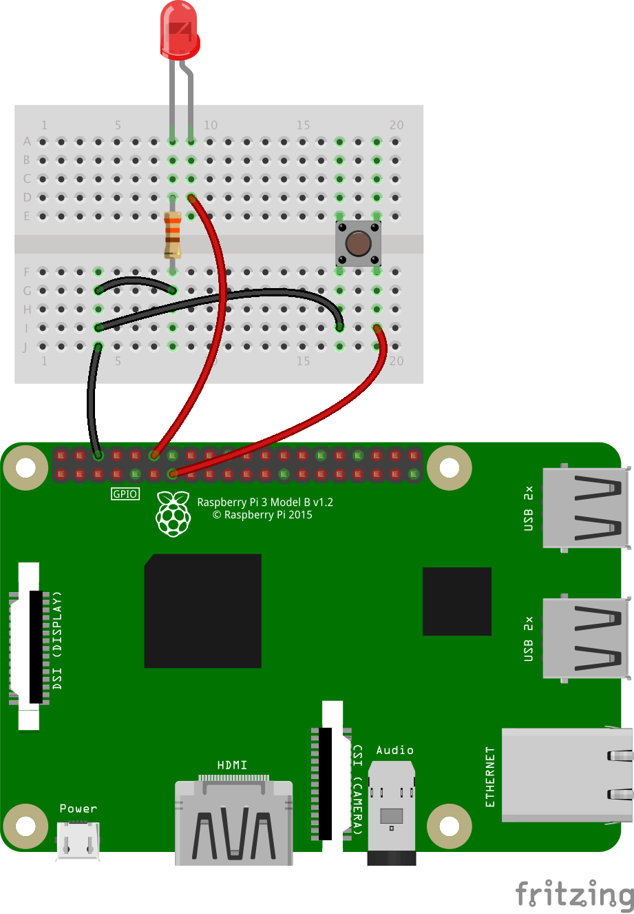

## Some "real" samples involving the components of the other projects
---
#### Summary
- [Home Weather Station](#weatherstation)
- [Robot on wheels](#robotonwheels)
- and more... This doc is lagging behind.

---

### <a name="weatherstation"></a>Home Weather Station
This one uses the `SDLWeather80422` class, from the `WeatherStation` project.
You can
- Read the data from the station 
- Simulate the data read from the station

Those data can then be rendered in different ways, with a Web Interface.
They are - for now - using a nodejs server and its WebSocket module, running on the Raspberry Pi.

After installing NodeJS (try [this](http://www.lmgtfy.com/?q=install+node+js+raspberry+pi)) on the Raspberry PI, in the `node` directory, install the WebSocket module:
```
Prompt> npm install websocket
```

Then you can start the node server:
```
Prompt> node weather.server.js
```

From another console, then start the process that will read the `SDLWeather80422`, and feed the WebSocket server:

```
Prompt> ./weather.station.reader
```

You can also start a simulator, in case you  are not on the Raspberry PI, and want to make some tests:
```
Prompt> ./weather.simulator
```

Then you can visualize the data in a browser, using a URL like 
`http://raspberrypi:9876/data/weather.station/index.html`

The analog console can be reached from `http://localhost:9876/data/weather.station/analog.html`, 
and it supports query string parameters `border` and `theme`.

`border` can be `Y` or `N`, and `theme` can be `black` or `white`.

_For example_:`http://localhost:9876/data/weather.station/analog.html?border=N&theme=white`.

See [here](http://www.lediouris.net/RaspberryPI/WeatherStation/readme.html).

---

### <a name="robotonwheels"></a>Robot on wheels

Uses jQuery and WebSockets.

Uses the Adafruit Motor Hat.

See the Java code [here](https://github.com/OlivierLD/raspberry-pi4j-samples/tree/develop/RasPISamples/src/robot/ws). The
`node.js` server code is in the `node` directory, see `robot.server.js`.

The Web interface main page is `robot.pilot.html`, served by `node.js` as well.

To proceed:
- start the `node.js` server, type in the `node` directory
```
prompt> node robot.server.js
```
- start the robot driver `robot.pilot`

#### Architecture


The [Adafruit Motor Hat](https://www.adafruit.com/products/2348) drives the servos, attached on the [Chassis](https://www.adafruit.com/product/2939).
The code for the Java Motor HAT is in the [I2C.SPI project, package i2c.servo.adafruitmotorhat](https://github.com/OlivierLD/raspberry-pi4j-samples/tree/master/I2C.SPI/src/i2c/servo/adafruitmotorhat).

_Note_: The Leap Motion client is mentioned as an example. Its implementation is not finished yet.

The WebSocket server is a `NodeJS` server, with the `websocket` module installed on it.
```
 prompt> cd node
 prompt> npm install websocket
```
Again, to start it:
```
 prompt> node robot.server.js
```
The `node` server is also an HTTP server, that serves the web pages used by the clients at the left of the diagram.

The `node` server can run on the Raspberry PI , or on another machine (in which case the `ws.uri` System variable in the Java code must be tweaked to point to it).

The actions (buttons pushed and released, etc) on the user interface (browser) are translated into `JSON` objects sent to the
WebSocket server. When receiving a message, the server re-broadcasts it to the connected client(s).
They are then received by the `WebSocket client` that talks to the MotorHAT driver accordingly.

The `JSON` message look like this
```
{
  "command": "forward",
  "speed": 128
}
```
See the code for details.

### One push button


Run
```bash
 $> ../gradlew clean shadowJar
```
Then just run the script named `pushbutton`.


### Reflex Game
Hit the button when the light goes on, and see how long it took you to react.


Run
```bash
 $> ../gradlew clean shadowJar
```
Then just run the script named `reflex`.