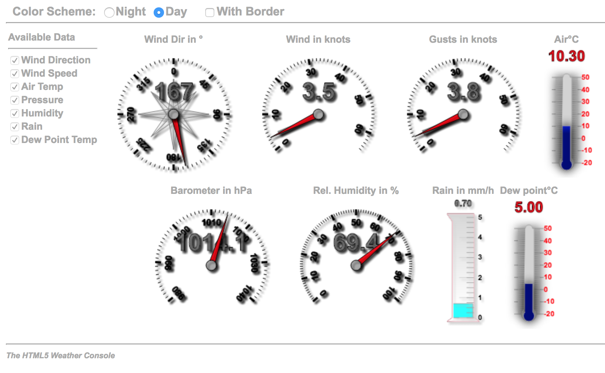
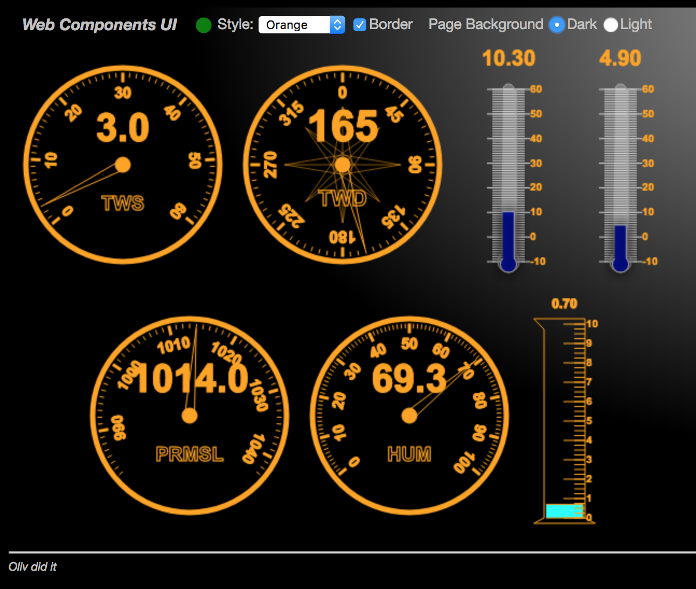

## Some "real" samples involving the components of the other projects
---
#### Summary
- [Home Weather Station](#weatherstation)
- [Robot on wheels](#robotonwheels)
- [Push button](#one-push-button)
- [Reflex game](#reflex-game)
- and more... This doc is lagging behind.

---

### <a name="weatherstation"></a>Home Weather Station
This one uses the `SDLWeather80422` class, from the `WeatherStation` project.
You can
- Read the data from the station
- Simulate the data read from the station

Those data can then be rendered in different ways, with a Web Interface.
They are - for now - using a nodejs server and its WebSocket module, running on the Raspberry Pi.

After installing NodeJS (try [this](http://www.lmgtfy.com/?q=install+node+js+raspberry+pi)) on the Raspberry PI, in the `node` directory, install the WebSocket module:
```
Prompt> npm install websocket
```

Then you can start the node server:
```
Prompt> node weather.server.js
```

From another console, then start the process that will read the `SDLWeather80422`, and feed the WebSocket server:

```
Prompt> ./weather.station.reader
```

You can also start a simulator, in case you  are not on the Raspberry PI, and want to make some tests:
```
Prompt> ./weather.simulator
```

Then you can visualize the data in a browser, using a URL like
`http://raspberrypi:9876/data/weather.station/index.html`

The analog console can be reached from `http://localhost:9876/data/weather.station/analog.all.html`,
and it supports query string parameters `border` and `theme`.

`border` can be `Y` or `N`, and `theme` can be `black` or `white`.

_For example_:`http://localhost:9876/data/weather.station/analog.html?border=N&theme=white`.

See [here](http://raspberrypi.lediouris.net/WeatherStation/readme.html).

> See also [this document](./src/java/weatherstation/README.md)

This implementation - just an example - uses:
- A Raspberry PI A+ connected to the weather rack (wind vane, anemometer, rain meter, temperature, pressure)
- It runs the scripts and classes mentioned above, along with a `nodejs` WebSocket server
- It uses several [`Loggers`](https://github.com/OlivierLD/raspberry-pi4j-samples/blob/master/RasPISamples/src/java/weatherstation/logger/LoggerInterface.java) to feed:
  - A MySQL database through REST Services developed in `php`
  - An HTTP tiny server that contains the last available data as a `json` object
  - A WebSocket client pushing the last available data as a `json` object
  - A TCP server that also converts the data in `NMEA` sentences before streaming them on a given TCP port

The TCP channel, conveying NMEA Data, is compatible with the `NMEA.multiplexer` project and `Node-RED`.



Web Socket Interface



Web Component Interface, pinging the NMEA Cache (`NMEA.multiplexer`) through REST services.


Web Interface


On the roof!

#### My current setting
- A Raspberry PI A+, connected on the `SDLWeather80422`. To start it,
run the `weather.menu.sh` script, choose option `N`, and then `W`.
```
+------------- Weather Station -----------------+
| N: Start Node server                          |
| W: Start Weather Station reader               |
| D: Start Weather Station dump                 |
| S: Show processes                             |
| K: Kill them all                              |
| Q: Quit                                       |
+-----------------------------------------------+
You Choose >
```
- An old laptop inside the house, running a `Raspberry PI desktop` (Debian Stretch) image,
where I run the following script:
```
$ NMEA.multiplexer> ./mux.sh nmea.mux.weather.station.tcp.properties
```
If the Raspberry PI's machine name is `weather-station` and the laptop's name is `home-station`,
then from anywhere is the house (house LAN), I can reach
```
 http://weather.station:9876/data/weather.station/analog.all.html
```

```
 http://home-station:9998/web/weather.station.html
```
as well as
```
 http://donpedro.lediouris.net/php/weather/reports.v2/weather.report.html
```
This last one can be reached from anywhere. See the screenshots for those URLs above.

---

### <a name="robotonwheels"></a>Robot on wheels

Uses jQuery and WebSockets.

Uses the Adafruit Motor Hat.

See the Java code [here](https://github.com/OlivierLD/raspberry-pi4j-samples/tree/develop/RasPISamples/src/robot/ws). The
`node.js` server code is in the `node` directory, see `robot.server.js`.

The Web interface main page is `robot.pilot.html`, served by `node.js` as well.

To proceed:
- start the `node.js` server, type in the `node` directory
```
prompt> node robot.server.js
```
- start the robot driver `robot.pilot`

#### Architecture


The [Adafruit Motor Hat](https://www.adafruit.com/products/2348) drives the servos, attached on the [Chassis](https://www.adafruit.com/product/2939).
The code for the Java Motor HAT is in the [I2C.SPI project, package i2c.servo.adafruitmotorhat](https://github.com/OlivierLD/raspberry-pi4j-samples/tree/master/I2C.SPI/src/i2c/servo/adafruitmotorhat).

_Note_: The Leap Motion client is mentioned as an example. Its implementation is not finished yet.

The WebSocket server is a `NodeJS` server, with the `websocket` module installed on it.
```
 prompt> cd node
 prompt> npm install websocket
```
Again, to start it:
```
 prompt> node robot.server.js
```
The `node` server is also an HTTP server, that serves the web pages used by the clients at the left of the diagram.

The `node` server can run on the Raspberry PI , or on another machine (in which case the `ws.uri` System variable in the Java code must be tweaked to point to it).

The actions (buttons pushed and released, etc) on the user interface (browser) are translated into `JSON` objects sent to the
WebSocket server. When receiving a message, the server re-broadcasts it to the connected client(s).
They are then received by the `WebSocket client` that talks to the MotorHAT driver accordingly.

The `JSON` message look like this
```
{
  "command": "forward",
  "speed": 128
}
```
See the code for details.

### One push button


Run
```bash
 $> ../gradlew clean shadowJar
```
Then just run the script named `pushbutton`.


### Reflex Game
Hit the button when the light goes on, and see how long it took you to react.


Run
```bash
 $> ../gradlew clean shadowJar
```
Then just run the script named `reflex`.

### Pitch and roll
Read an LSM303 I2C board to get the pitch and roll. Feeds a WebSocket server with the data.
An HTML page displays a boat, graphically, with the appropriate picth and roll.

Run
```bash
 $> ../gradlew clean shadowJar
```
Then, from one shell
```bash
 $> cd node
 $> node server.js
```
And from another one
```bash
 $> ./pitchroll

```
Then from a browser, reach the machine where `node` is running:
```
 http://<machine-name>:9876/data/pitchroll.html
```


