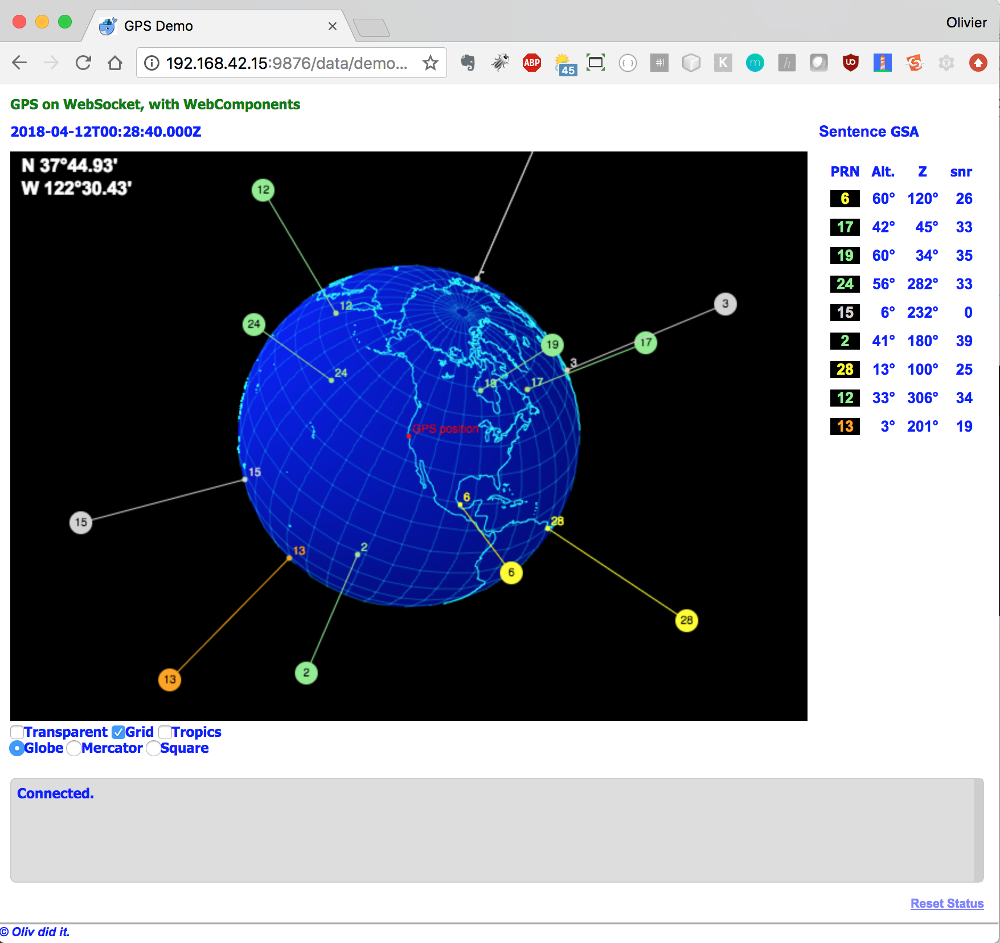

### Docker

Get Docker on your system : https://store.docker.com/search?type=edition&offering=community

From the directory the `Dockerfile` lives in:
```bash
$ docker build -t oliv-image .
```
and to log in the image:
```bash
$ docker run -it oliv-image /bin/bash
```
to start the server:
```bash
$ docker run --name rest-nav-server -p 8080:9999 -d oliv-image
```

From the host (where the `docker` command was fired), reach for example http://localhost:8080/oplist

Yeah!

From another shell:
```bash
$ docker ps
CONTAINER ID        IMAGE               COMMAND                  CREATED             STATUS                      PORTS               NAMES
a335f585deb0        oliv-image          "/bin/bash"              36 minutes ago      Exited (0) 35 minutes ago                       confident_proskuriakova
f36550370ea8        445821efd8a0        "/bin/sh -c 'echo “g…"   44 minutes ago      Exited (2) 44 minutes ago                       affectionate_davinci
```


Get the CONTAINER ID like `a335f585deb0`
```bash
$ docker stop a335f585deb0
```

To drop the image:
```bash
$ docker rmi oliv-image
```

### Examples

```bash
$ cp Dockerfile.web-components Dockerfile
$ docker build -t oliv-image .
$ docker run -p 8081:8080 -it oliv-image /bin/bash
root@7e754f8732a0:/workdir/raspberry-pi4j-samples/WebComponents# node server.js
```

Then reach `http://localhost:8081/oliv-components/index.html`

etc, etc...

Several images can be built from the script `image.builder.sh`.

### Case Study
You have a `nodejs` project you want to share with others.

The application read GPS data through a Serial port, and feeds a `WebSocket` server.
The data can then be visualized thnrough a Web interface.

To enable everything, you need to:
1. Have a Raspberry PI
1. Flash its SD card
1. Install build tools
1. Install `git`
1. Install `NodeJS` and `npm`
1. Clone the right `git` repository
1. Install *_all_* the required `node` modules
1. Drill down into the right directory
1. Start the `node` server with the right script
1. Access the Raspberry PI from another machine on the same network, and reach the right HTML page.

This is certainly not difficult, but there are many ways to do several mistakes at each step
of the process.

`Docker` can take care of the steps `3` to `9`.
It will build the image, and then run it.
The image can also be pushed to a repository, so user users would not have to build it.
Just to run it after downloading it.

The only pre-requisite would be to have installed `Docker` on the machine (the Raspberry PI here),
as explained at the top of this document.

In this case, the full `Docker` image creation (named `oliv-nodepi` below) comes down to:
```bash
 $ cp Dockerfile.node-pi Dockerfile
 $ docker build -t oliv-nodepi .
```
The `cp` operation above is required here because we have several `Dockerfile`s available, to create several different images.

Once the step above is completed, plug in your GPS, and run
```bash
 $ docker run -p 9876:9876 -t -i --privileged -v /dev/ttyUSB0:/dev/ttyUSB0 -d oliv-nodepi:latest
```
Then from a machine seeing the Raspberry PI on its network (it can be the Raspberry PI itself),
reach http://raspi:9876/data/demos/gps.demo.wc.html in a browser.



The build operation needs to be done once. There is no need to do it again as long as no
change in the image is required.


--------------------------------------------------------------------------
